# Documento de Software — App de Gestão para Artesãos
## Documento Consolidado Final

---

# 1. Levantamento de Requisitos

## 1.1 Requisitos Funcionais (RF)

| ID | Descrição | Prioridade | Ator/Origem |
|----|-----------|-----------|-------------|
| RF01 | Sistema deve permitir que o artesão realize login com e-mail e senha via Supabase Auth *(base: Etapa 1, Seção 4)* | Alta | Artesão |
| RF02 | Sistema deve permitir que o artesão realize logout, encerrando a sessão *(base: Etapa 1, Seção 7)* | Alta | Artesão |
| RF03 | Sistema deve exibir os pedidos do artesão organizados em três colunas Kanban: **A Fazer**, **Fazendo** e **Feito** *(base: Etapa 1, Seção 1 / Seção 7)* | Alta | Artesão |
| RF04 | Sistema deve permitir que o artesão mova um card de pedido entre as colunas do Kanban *(base: Etapa 1, Seção 1)* | Alta | Artesão |
| RF05 | Sistema deve **exigir** que o artesão fotografe a escultura pronta antes de mover o card da coluna "Fazendo" para a coluna "Feito" — sem bypass ou configuração *(base: Etapa 1, Seção 5 / Decisão #7)* | Alta | Artesão |
| RF06 | Sistema deve permitir que o artesão cadastre um novo cliente com nome e dados de contato *(base: Etapa 1, Seção 1)* | Alta | Artesão |
| RF07 | Sistema deve permitir que o artesão registre um novo pedido vinculado a um cliente, informando canal de origem (Instagram, WhatsApp, Presencial, Telefone, Outros), descrição e data de entrega *(base: Etapa 1, Seção 1)* | Alta | Artesão |
| RF08 | Sistema deve permitir que o artesão consulte o estoque de obras prontas, listando nome, tipo (única/série) e quantidade disponível *(base: Etapa 1, Seção 1 / Seção 3)* | Alta | Artesão |
| RF09 | Sistema deve permitir que o artesão cadastre uma obra no estoque informando nome, tipo (`unica` ou `serie`) e, para obras em série, a quantidade de unidades, com foto opcional de catálogo *(base: Etapa 1, Seção 3 / Decisão #8)* | Alta | Artesão |
| RF10 | Sistema deve realizar baixa de estoque conforme o tipo da obra: para obras **únicas**, marcar como "Reservada" ao ser vinculada a um pedido, dando baixa definitiva quando o pedido for "Feito"; para obras **em série**, decrementar `quantidade` imediatamente ao vincular; ao cancelar o pedido, restaurar a quantidade (+1) ou retornar a obra única a "Disponível" *(base: Etapa 1, Seção 3)* | Alta | Sistema |
| RF11 | Sistema deve permitir que o artesão vincule uma obra do estoque a um pedido existente *(base: Etapa 1, Seção 1)* | Alta | Artesão |
| RF12 | Sistema deve permitir que o artesão cadastre um evento/feira informando nome, data, endereço textual, coordenadas (via geolocalização ou seleção manual no mapa) e observações *(base: Etapa 1, Seção 5)* | Média | Artesão |
| RF13 | Sistema deve exibir os eventos cadastrados como pins em um mapa visual; sem conexão, exibir a lista e os pins cacheados (tiles exigem rede) *(base: Etapa 1, Seção 1 / Seção 5)* | Média | Artesão |
| RF14 | Sistema deve permitir que o artesão opere as funcionalidades principais — visualizar e mover cards do Kanban, consultar estoque, registrar pedidos e clientes, gerenciar eventos — sem conexão com a internet *(base: Etapa 1, Seção 3)* | Alta | Artesão |
| RF15 | Sistema deve enfileirar as operações realizadas offline na tabela `fila_sync` com status `pendente` e sincronizá-las automaticamente com o Supabase quando a conexão for restabelecida *(base: Etapa 1, Seção 3)* | Alta | Sistema |
| RF16 | Sistema deve fazer upload das imagens (conclusão e catálogo) para o Supabase Storage durante a sincronização, após comprimir as imagens localmente *(base: Etapa 1, Seção 4 / Seção 5)* | Alta | Sistema |
| RF17 | Sistema deve exibir um banner de aviso quando o dispositivo estiver sem conexão e ocultá-lo ao restabelecer a rede *(base: Etapa 1, Seção 6)* | Média | Sistema |
| RF18 | Sistema deve permitir que o artesão edite os dados de um cliente existente (nome e contato) | Média | Artesão |
| RF19 | Sistema deve permitir que o artesão edite um pedido cujo status seja **A Fazer** (descrição, data de entrega, obra vinculada) | Média | Artesão |
| RF20 | Sistema deve permitir que o artesão cancele/remova um pedido — com confirmação explícita antes da exclusão, com compensação de estoque | Média | Artesão |
| RF21 | Sistema deve permitir que o artesão adicione unidades manualmente a uma obra em série no estoque (ex: nova leva de produção) | Alta | Artesão |
| RF22 | Sistema deve permitir que o artesão remova/arquive uma obra do estoque (ex: peça danificada ou descontinuada) — com confirmação explícita; obras vinculadas a pedido aberto não podem ser removidas | Média | Artesão |
| RF23 | Sistema deve permitir que o artesão edite um evento/feira existente (nome, data, local, observações) | Média | Artesão |
| RF24 | Sistema deve permitir que o artesão remova um evento cancelado — com confirmação explícita antes da exclusão | Média | Artesão |

## 1.2 Requisitos Não Funcionais (RNF)

| ID | Descrição | Prioridade | Ator/Origem |
|----|-----------|-----------|-------------|
| RNF01 | **Desempenho:** O painel Kanban e a lista de estoque devem abrir em menos de 1 segundo, mesmo sem conexão, carregando dados do SQLite local *(base: Etapa 1, Seção 3)* | Alta | Equipe técnica |
| RNF02 | **Confiabilidade:** Nenhuma ação realizada offline pode ser perdida — toda operação deve ser persistida localmente no SQLite antes de retornar sucesso ao usuário, independentemente do status da rede *(base: Etapa 1, Seção 3)* | Alta | Equipe técnica |
| RNF03 | **Segurança:** As políticas RLS (Row Level Security) do Supabase devem garantir que o artesão autenticado leia, insira e edite apenas os dados vinculados ao seu próprio ID de usuário *(base: Etapa 1, Seção 4)* | Alta | Equipe técnica |
| RNF04 | **Confiabilidade (conflito):** Conflitos de escrita concorrente devem ser resolvidos via timestamp gerado pelo servidor (Supabase), nunca pelo relógio do dispositivo; o `created_at_local` é preservado como metadado separado apenas para rastreabilidade *(base: Etapa 1, Seção 4 / Decisão #2)* | Alta | Equipe técnica |
| RNF05 | **Usabilidade:** A interface deve priorizar labels explícitos, confirmações visuais claras e onboarding guiado, adequada a usuário com letramento digital básico (nível: uso simples de redes sociais) *(base: Etapa 1, Seção 1 / Decisão #6)* | Alta | Artesão |
| RNF06 | **Armazenamento de imagens:** Toda imagem deve ser comprimida antes de ser salva no sistema de arquivos do dispositivo (`expo-file-system`) e antes do upload ao Supabase Storage, preservando a persistência offline *(base: Etapa 1, Seção 5 / Decisão #9)* | Alta | Equipe técnica |
| RNF07 | **Portabilidade:** O app deve executar em iOS e Android via Expo/React Native, com comportamento equivalente em ambas as plataformas *(base: Etapa 1, Seção 2)* | Alta | Equipe técnica |
| RNF08 | **Escalabilidade (dados):** O volume estimado de dados é inferior a 30 obras/ano; a solução deve operar dentro dos limites do Free tier do Supabase sem necessidade de paginação *(base: Etapa 1, Decisão #10)* | Baixa | Equipe técnica |
| RNF09 | **Manutenibilidade:** O código deve seguir os princípios de Clean Architecture e Domain-Driven Design, separando núcleo de regras de negócio (domain/application) das camadas externas (adapters/infra), sem importar libs de banco ou framework dentro de entidades ou use cases *(base: Etapa 1, Seção 6)* | Alta | Equipe técnica |
| RNF10 | **Conformidade (usuário único):** O sistema suporta exatamente um usuário autenticado; todo dado operacional é escopado por `usuario_id` (`auth.uid()`); compartilhamento de contas não é suportado *(base: Etapa 1, Seção 4 / Decisão #1 / Decisão #3)* | Alta | Equipe técnica |
| RNF11 | **Confiabilidade (imagem de conclusão):** A regra de exigir fotografia para fechar um pedido ("Fazendo" → "Feito") é uma restrição rígida do sistema — não pode ser contornada por configuração, permissão ou fluxo alternativo *(base: Etapa 1, Decisão #7)* | Alta | Equipe técnica |

---

# 2. Diagrama de Casos de Uso

## 2.1 Atores

| Ator | Tipo | Descrição |
|------|------|-----------|
| **Artesão** | Primário | Único usuário do sistema; inicia todos os casos de uso interativos *(base: Etapa 1, Seção 1 / Decisão #1)* |
| **Monitor de Rede** | Sistema (evento) | Listener interno que detecta mudanças de conectividade e dispara sync e banner *(base: Etapa 1, Seção 6)* |
| **Supabase** | Secundário externo | Plataforma de backend — Auth, banco de dados e Storage; participa de login e sincronização *(base: Etapa 1, Seção 4)* |

> Não há ator `Administrador` — o app suporta um único usuário *(base: Etapa 1, Decisão #1 / Decisão #3)*.

## 2.2 Diagrama de Casos de Uso

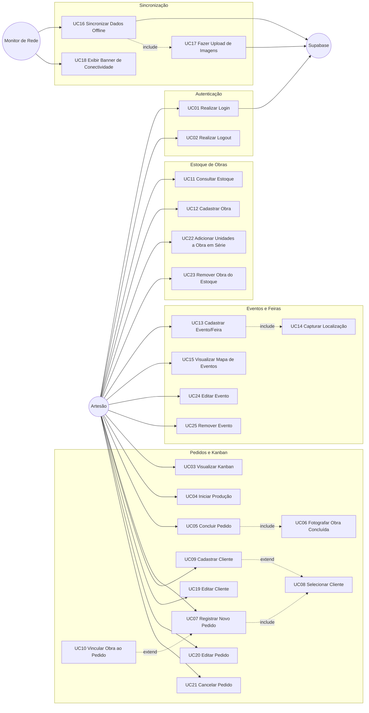

### Legenda de relações

| Notação | Semântica |
|---------|-----------|
| `──►` sólida | Ator inicia o caso de uso |
| `-. include .-►` tracejada | Comportamento obrigatório, sempre executado como parte do caso base |
| `-. extend .-►` tracejada | Comportamento opcional/condicional, insere-se quando a condição de extensão é satisfeita |

## 2.3 Mapeamento UC ↔ RF

| Caso de Uso | RFs Atendidos |
|-------------|--------------|
| UC01 Realizar Login | RF01 |
| UC02 Realizar Logout | RF02 |
| UC03 Visualizar Kanban | RF03 |
| UC04 Iniciar Produção | RF04 |
| UC05 Concluir Pedido | RF04, RF05 |
| UC06 Fotografar Obra Concluída | RF05 |
| UC07 Registrar Novo Pedido | RF07, RF14 |
| UC08 Selecionar Cliente | RF07 |
| UC09 Cadastrar Cliente | RF06, RF14 |
| UC10 Vincular Obra ao Pedido | RF10, RF11 |
| UC11 Consultar Estoque de Obras | RF08, RF14 |
| UC12 Cadastrar Obra no Estoque | RF09, RF14 |
| UC13 Cadastrar Evento/Feira | RF12 |
| UC14 Capturar Localização | RF12 |
| UC15 Visualizar Mapa de Eventos | RF13 |
| UC16 Sincronizar Dados Offline | RF15 |
| UC17 Fazer Upload de Imagens | RF16 |
| UC18 Exibir Banner de Conectividade | RF17 |
| UC19 Editar Cliente | RF18 |
| UC20 Editar Pedido | RF19 |
| UC21 Cancelar Pedido | RF20 |
| UC22 Adicionar Unidades a Obra em Série | RF21 |
| UC23 Remover Obra do Estoque | RF22 |
| UC24 Editar Evento | RF23 |
| UC25 Remover Evento | RF24 |

## 2.4 Descrições Textuais dos Casos de Uso Principais

---

### UC01 — Realizar Login

**Ator primário:** Artesão  
**Ator secundário:** Supabase (Auth)  
**Pré-condições:**
- Artesão possui conta cadastrada no Supabase Auth.
- App instalado e com conectividade (login exige rede).

**Fluxo principal:**
1. Artesão abre o app e é redirecionado para a tela de Login (rota pública).
2. Artesão informa e-mail e senha.
3. App envia credenciais ao Supabase Auth.
4. Supabase valida e retorna token de sessão.
5. App persiste token localmente e redireciona para a área protegida (Bottom Tabs: Kanban, Estoque, Eventos).

**Fluxos alternativos:**
- **FA1 — Credenciais inválidas:** Supabase retorna erro; app exibe mensagem "E-mail ou senha incorretos"; fluxo retorna ao passo 2.
- **FA2 — Sem conectividade:** App detecta ausência de rede antes do envio; exibe aviso "Sem conexão — login requer internet"; bloqueia o passo 3.
- **FA3 — Sessão já ativa:** Se token válido já persistido, app pula para o passo 5 sem exibir a tela de login.

**Pós-condições:**
- Artesão autenticado; token de sessão disponível para requisições subsequentes.
- Dados locais do SQLite ficam disponíveis para operações offline imediatas.

*(base: Etapa 1, Seção 4 / RF01)*

---

### UC05 — Concluir Pedido (Fazendo → Feito)

**Ator primário:** Artesão  
**Pré-condições:**
- Pedido existe no sistema com status `Fazendo`.
- Câmera do dispositivo disponível e com permissão concedida.

**Fluxo principal:**
1. Artesão acessa o Kanban e localiza o card do pedido na coluna "Fazendo".
2. Artesão aciona "Mover para Feito".
3. **[include UC06]** Sistema abre a câmera e solicita que o artesão fotografe a obra concluída.
4. Artesão captura a foto.
5. App comprime a imagem e a salva localmente (`expo-file-system`) vinculada ao pedido.
6. Sistema atualiza o status do pedido para `Feito` no SQLite com `status_sync = 'pendente'` e registra a operação na `fila_sync`.
7. Card move-se visualmente para a coluna "Feito".
8. Se conectado, a fila de sync é processada imediatamente (UC16 → UC17).

**Fluxos alternativos:**
- **FA1 — Artesão cancela a câmera:** Sistema aborta a operação; status do pedido permanece `Fazendo`; exibe aviso "Foto obrigatória para concluir o pedido." *(regra rígida, sem bypass — base: Etapa 1, Decisão #7 / RNF11)*.
- **FA2 — Câmera sem permissão:** App exibe diálogo de solicitação de permissão; se negada, operação é abortada com aviso de instrução para habilitar nas configurações do dispositivo.
- **FA3 — Offline:** Passo 6 salva localmente; passo 8 não ocorre; enfileiramento para sync posterior.

**Pós-condições:**
- Pedido no status `Feito`.
- Imagem da obra concluída persistida localmente e associada ao pedido.
- Se obra vinculada for do tipo `unica`, seu status no estoque é atualizado para `Entregue`.

*(base: Etapa 1, Seção 5 / Decisão #7 / RNF11 / RF04, RF05)*

---

### UC07 — Registrar Novo Pedido

**Ator primário:** Artesão  
**Pré-condições:**
- Artesão autenticado.
- (Opcional) Cliente já cadastrado no sistema.

**Fluxo principal:**
1. Artesão aciona "Novo Pedido" (via FAB no Kanban ou menu de navegação).
2. App exibe formulário de novo pedido com campos: canal de origem, descrição, data de entrega.
3. Artesão seleciona o canal de origem (Instagram / WhatsApp / Presencial / Telefone / Outros).
4. **[include UC08]** Artesão seleciona o cliente vinculado ao pedido.
5. Artesão preenche descrição e data de entrega.
6. Artesão confirma o cadastro.
7. App persiste o pedido no SQLite com status `A Fazer` e `status_sync = 'pendente'`, com registro na `fila_sync`.
8. Card aparece na coluna "A Fazer" do Kanban.

**Fluxos alternativos:**
- **FA1 — Cliente não encontrado em UC08:** Sistema oferece ação "Cadastrar novo cliente"; **[extend UC09]** artesão cadastra o cliente; fluxo retorna ao passo 4 com o novo cliente selecionado.
- **FA2 — Artesão vincula obra do estoque:** **[extend UC10]** Artesão aciona "Vincular obra"; seleciona obra disponível no estoque; sistema aplica baixa conforme tipo (`unica` → Reservada; `serie` → decremento de quantidade).
- **FA3 — Offline:** Fluxo ocorre integralmente; dados persistidos localmente; sync ocorre quando rede for restabelecida.

**Pós-condições:**
- Pedido criado com status `A Fazer`, vinculado a um cliente.
- Card exibido na coluna "A Fazer" do Kanban.
- (Se FA2) Baixa de estoque aplicada conforme tipo da obra.

*(base: Etapa 1, Seção 1 / Seção 3 / RF06, RF07, RF10, RF11, RF14)*

---

### UC12 — Cadastrar Obra no Estoque

**Ator primário:** Artesão  
**Pré-condições:**
- Artesão autenticado.

**Fluxo principal:**
1. Artesão acessa a tela de Estoque e aciona "Nova Obra".
2. App exibe formulário com campos: nome, tipo (`Única` ou `Em Série`), foto.
3. Artesão preenche o nome e seleciona o tipo.
4. Se tipo = `Em Série`: campo `quantidade` fica obrigatório e visível; artesão informa a quantidade de unidades.
5. (Opcional) Artesão fotografa a obra para o catálogo.
6. Artesão confirma o cadastro.
7. App persiste a obra no SQLite com status inicial `Disponível` e `status_sync = 'pendente'`.
8. Obra aparece na lista de estoque.

**Fluxos alternativos:**
- **FA1 — Tipo `Única`:** Campo `quantidade` oculto/fixado em 1; sem alteração no fluxo.
- **FA2 — Artesão não fotografa:** Obra cadastrada sem foto; ação opcional.
- **FA3 — Offline:** Persiste localmente; sync posterior.

**Pós-condições:**
- Obra disponível no estoque com status `Disponível`.
- Para obras em série: `quantidade > 0`.
- Para obras únicas: disponível para vinculação a um único pedido.

*(base: Etapa 1, Seção 3 / Decisão #8 / RF09)*

---

### UC13 — Cadastrar Evento/Feira

**Ator primário:** Artesão  
**Pré-condições:**
- Artesão autenticado.
- GPS do dispositivo disponível (ou possibilidade de seleção manual no mapa).

**Fluxo principal:**
1. Artesão acessa a tela de Mapa de Eventos e aciona "Novo Evento".
2. App exibe formulário: nome, data, endereço textual, observações.
3. Artesão preenche nome e data.
4. **[include UC14]** App solicita captura de localização: exibe mapa com pin arrastável e opção de usar GPS atual; artesão confirma o ponto.
5. Artesão preenche endereço textual (complemento descritivo) e observações (opcional).
6. Artesão confirma o cadastro.
7. App persiste o evento no SQLite com `status_sync = 'pendente'` e registro na `fila_sync`.
8. Pin do evento aparece no mapa.

**Fluxos alternativos:**
- **FA1 — GPS indisponível/negado:** App permite posicionamento manual do pin diretamente no mapa; fluxo continua.
- **FA2 — Offline:** Persiste localmente; sync posterior; lista e pins cacheados continuam visíveis (tiles do mapa exigem rede).

**Pós-condições:**
- Evento registrado com nome, data, coordenadas, endereço e observações.
- Pin visível no mapa da tela de Eventos.

*(base: Etapa 1, Seção 5 / RF12, RF13)*

---

### UC16 — Sincronizar Dados Offline

**Ator primário:** Monitor de Rede (sistema)  
**Atores secundários:** Supabase (banco de dados), Supabase Storage  
**Pré-condições:**
- Existem registros com `status_sync = 'pendente'` na fila local do SQLite.
- Conexão com a internet foi restabelecida (evento detectado pelo listener de rede).

**Fluxo principal:**
1. Monitor de Rede detecta restauração da conectividade.
2. App aciona o serviço de sincronização em segundo plano (sem interromper a navegação do artesão).
3. **[include UC17]** App identifica imagens pendentes de upload; comprime e faz upload para o Supabase Storage; obtém URLs públicas.
4. App lê a fila de operações pendentes (`fila_sync`: criação/edição de pedidos, clientes, obras, eventos).
5. Para cada operação, app realiza o upsert no Supabase via API, usando o server timestamp gerado pelo Supabase como timestamp oficial do registro.
6. Registro atualizado com `status_sync = 'sincronizado'` no SQLite local e na `fila_sync`.
7. URLs das imagens retornadas pelo Storage são gravadas nos registros correspondentes.

**Fluxos alternativos:**
- **FA1 — Conexão perdida durante sync:** Operações já enviadas são marcadas como `sincronizado`; operações pendentes permanecem na fila; sync retoma quando a rede retornar.
- **FA2 — Erro de upload de imagem:** Operação de imagem retorna para a fila com tentativa futura; não bloqueia sync dos demais registros.
- **FA3 — Fila vazia:** Serviço de sync é acionado mas não executa operações; finaliza silenciosamente.

**Pós-condições:**
- Todos os registros com `status_sync = 'pendente'` foram enviados ao Supabase ou mantidos na fila para nova tentativa.
- Timestamps oficiais (server timestamp) gravados nos registros sincronizados.
- `created_at_local` preservado como metadado separado para rastreabilidade *(base: Etapa 1, Seção 4 / Decisão #2 / RNF04)*.

*(base: Etapa 1, Seção 3 / Seção 4 / RF15, RF16)*

---

# 3. Diagrama de Classes

## 3.1 Diagrama de Classes

### Extração de candidatos a classes

Substantivos dos casos de uso e requisitos:

| Substantivo | Classe candidata | Descartado? |
|-------------|-----------------|-------------|
| Artesão / Usuário | `Usuario` | Não |
| Cliente | `Cliente` | Não |
| Pedido / Encomenda | `Pedido` | Não |
| Obra / Escultura | `Obra` | Não |
| Evento / Feira | `Evento` | Não |
| Fila de Sync | `FilaSync` | Não (infraestrutura) |
| Canal de Origem | `CanalOrigem` | Enum — embutido em `Pedido` |
| Status do Pedido | `StatusPedido` | Enum — embutido em `Pedido` |
| Tipo de Obra | `TipoObra` | Enum — embutido em `Obra` |
| Status da Obra | `StatusObra` | Enum — embutido em `Obra` |
| Status de Sync | `StatusSync` | Enum transversal |
| Item de Pedido | — | **Descartado**: pedido tem exatamente 1 obra opcional; sem lista de itens neste domínio |
| Pagamento | — | **Descartado**: fora do escopo *(base: Etapa 1, Seção 7)* |

---

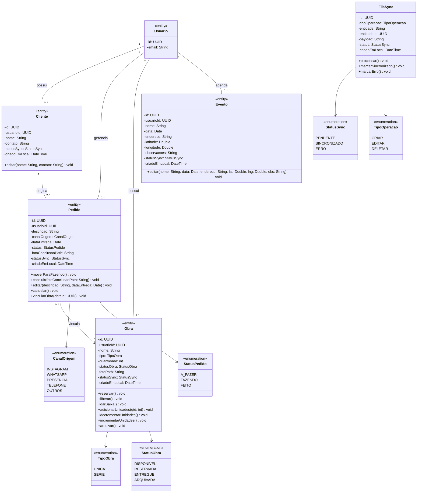

### Notas sobre relações

| Relação | Tipo | Justificativa |
|---------|------|---------------|
| `Usuario -- Cliente/Pedido/Obra/Evento` | Associação 1–0..* | Todo dado operacional é escopado por `usuario_id`; sem entidade intermediária *(base: Etapa 1, Decisão #3 / RNF10)* |
| `Cliente -- Pedido` | Associação 1–0..* | Pedido pertence a um cliente; cliente pode existir sem pedidos |
| `Pedido --> Obra` | Associação 0..*–0..1 | Pedido pode ou não estar vinculado a uma obra do estoque; para `UNICA`, regra de negócio em `Obra.reservar()` limita a 1 vínculo ativo; para `SERIE`, múltiplos pedidos podem referenciar a mesma obra |

### Restrições de negócio nos métodos de `Obra`

| Método | Regra |
|--------|-------|
| `reservar()` | Válido somente se `tipo = UNICA` e `statusObra = DISPONIVEL`; lança exceção caso contrário |
| `liberar()` | Válido somente se `tipo = UNICA` e `statusObra = RESERVADA` |
| `darBaixa()` | Válido somente se `tipo = UNICA`; muda `statusObra` para `ENTREGUE` |
| `decrementarUnidades()` | Válido somente se `tipo = SERIE` e `quantidade > 0` |
| `adicionarUnidades(qtd)` | Válido somente se `tipo = SERIE` e `qtd > 0` *(base: RF21)* |
| `incrementarUnidades()` | Compensação de cancelamento em `SERIE`: `quantidade += 1` *(base: RF10, RF20)* |
| `arquivar()` | Bloqueado se obra está vinculada a pedido com `status != FEITO` *(base: RF22)* |

### Restrições de negócio nos métodos de `Pedido`

| Método | Regra |
|--------|-------|
| `moverParaFazendo()` | Válido somente se `status = A_FAZER` |
| `concluir(fotoConclusaoPath)` | Válido somente se `status = FAZENDO` e `fotoConclusaoPath` não nulo/vazio *(regra rígida — base: Etapa 1, Decisão #7 / RNF11)* |
| `editar(...)` | Válido somente se `status = A_FAZER` *(base: RF19)* |
| `cancelar()` | Disponível em qualquer status, com confirmação explícita; dispara `Obra.liberar()` se obra `UNICA` vinculada, ou `Obra.incrementarUnidades()` se `SERIE` *(base: RF20)* |
| `vincularObra(obraId)` | Válido somente se `status = A_FAZER`; delega regra de baixa ao tipo da obra |

## 3.2 Tabela de Persistência

| Classe | Persistente? | Estratégia | Observação |
|--------|-------------|-----------|------------|
| `Usuario` | Sim (parcial) | Gerenciado pelo Supabase Auth (`auth.users`); tabela `profiles` no Supabase com PK = `auth.users.id` (UUID); **somente remota** — não replicada no SQLite local | ID = UUID do Supabase Auth *(base: Etapa 1, Seção 4)* |
| `Cliente` | Sim | SQLite: `clientes`; Supabase: `clientes`; PK `id` UUID, FK `usuario_id` UUID | Offline-first *(base: Etapa 1, Seção 3)* |
| `Pedido` | Sim | SQLite: `pedidos`; Supabase: `pedidos`; PK `id` UUID, FK `usuario_id` UUID, FK `cliente_id` UUID, FK `obra_id` UUID (nullable) | Foto conclusão: path local (`foto_conclusao_path`) + URL remota pós-sync (`foto_conclusao_url`) *(base: Etapa 1, Seção 5)* |
| `Obra` | Sim | SQLite: `obras`; Supabase: `obras`; PK `id` UUID, FK `usuario_id` UUID; colunas `tipo` (enum string), `quantidade` INT, `status_obra` (enum string) *(base: Etapa 1, Seção 3 / Decisão #8)* | Foto catálogo: path local + URL remota pós-sync |
| `Evento` | Sim | SQLite: `eventos`; Supabase: `eventos`; PK `id` UUID, FK `usuario_id` UUID; colunas `latitude` DOUBLE, `longitude` DOUBLE *(base: Etapa 1, Seção 5)* | Lista funciona offline; tiles do mapa exigem rede |
| `FilaSync` | Sim (local only) | SQLite: `fila_sync`; **não replicada no Supabase** — tabela de controle interno de sync; colunas `tipo_operacao`, `entidade`, `entidade_id` UUID, `payload` JSON, `status` enum string, `criado_em_local` | *(base: Etapa 1, Seção 3)* |
| `CanalOrigem` | Não (enum) | Coluna `canal_origem` TEXT em `pedidos`; valores: `INSTAGRAM`, `WHATSAPP`, `PRESENCIAL`, `TELEFONE`, `OUTROS` | *(base: RF07)* |
| `StatusPedido` | Não (enum) | Coluna `status` TEXT em `pedidos`; valores: `A_FAZER`, `FAZENDO`, `FEITO` | — |
| `TipoObra` | Não (enum) | Coluna `tipo` TEXT em `obras`; valores: `UNICA`, `SERIE` | *(base: Etapa 1, Decisão #8)* |
| `StatusObra` | Não (enum) | Coluna `status_obra` TEXT em `obras`; valores: `DISPONIVEL`, `RESERVADA`, `ENTREGUE`, `ARQUIVADA` | `RESERVADA` válido somente para `tipo = UNICA` |
| `StatusSync` | Não (enum) | Coluna `status_sync` TEXT em todas as tabelas offline-first; valores: `PENDENTE`, `SINCRONIZADO`, `ERRO` | *(base: Etapa 1, Seção 3)* |
| `TipoOperacao` | Não (enum) | Coluna `tipo_operacao` TEXT em `fila_sync`; valores: `CRIAR`, `EDITAR`, `DELETAR` | — |

### Campo `created_at_local` (transversal)

Todas as tabelas offline-first (`clientes`, `pedidos`, `obras`, `eventos`) possuem a coluna `created_at_local DATETIME` preenchida pelo dispositivo no momento da criação. Usada **exclusivamente para rastreabilidade** — não substitui o server timestamp como critério de desempate em conflitos *(base: Etapa 1, Seção 4 / Decisão #2 / RNF04)*.

## 3.3 Diagrama Entidade-Relacionamento (DER)

Este diagrama materializa a visão relacional do banco de dados (SQLite local e Supabase remoto), derivada da Tabela de Persistência (Seção 3.2).

As cardinalidades foram estritamente alinhadas com as multiplicidades do Diagrama de Classes (Seção 3.1):
- `Usuario` possui relação `1:N` com as entidades operacionais, estabelecendo o escopo de permissões (RLS por `usuario_id` no Supabase).
- `Cliente` possui `1:N` com `Pedido`.
- `Obra` possui `1:N` opcional com `Pedido` (no banco, materializado como a chave estrangeira nula `obra_id` na tabela `PEDIDO`), já que obras em série podem estar em vários pedidos e um pedido não obrigatoriamente tem uma obra desde o momento da criação.
- `FilaSync` é uma tabela estritamente local (sem contraparte no Supabase) e se relaciona com as demais entidades de forma polimórfica (via `entidade` + `entidade_id`), sem restrição de chave estrangeira (FK) estrita no nível do banco.
- Valores enumerados (`CanalOrigem`, `StatusPedido`, etc.) foram persistidos como colunas descritivas (strings) dentro de suas respectivas tabelas.
- IDs são UUID v4 gerados no dispositivo, usados como PK tanto no SQLite quanto no Supabase.

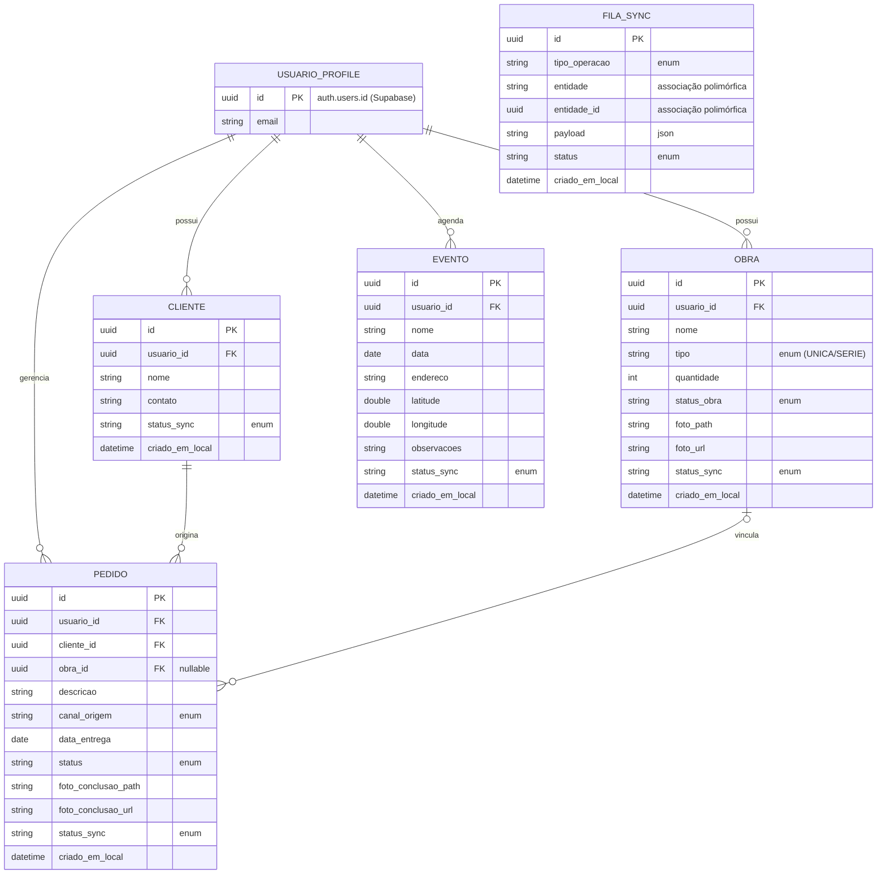

*(base: Etapa 1, Seções 3 e 4; restrições derivadas da Seção 3)*

---

# 4. Diagrama de Objetos

## 4.1 Diagrama de Instâncias (Snapshot)

Este diagrama representa um instantâneo (snapshot) em tempo de execução do sistema, materializando as classes definidas na Seção 3.

**Cenário ilustrado:**
O artesão (`usuario1`) possui um cliente cadastrado (`clienteJoao`) que realizou dois pedidos.
- O `pedido101` (Fazendo) está vinculado a uma obra exclusiva (`obraAguia`), cujo tipo é `UNICA`. Por conta desse vínculo ativo, o status da obra reflete `RESERVADA`.
- O `pedido102` (Feito) foi uma venda presencial de uma obra repetível (`obraCoruja`), do tipo `SERIE`. A obra continua com status `DISPONIVEL` e a quantidade restante é 4, pois a baixa do estoque nesse tipo ocorre por decremento da quantidade, não por retenção de estado.

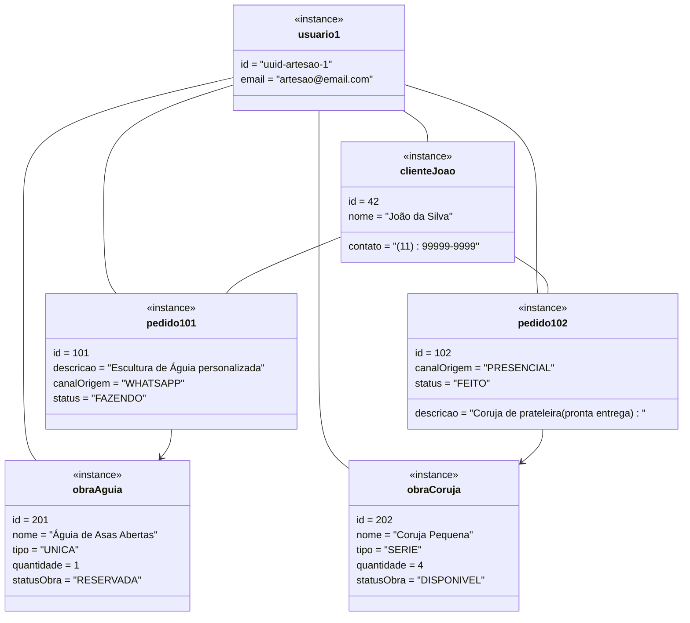

### Validação de Cardinalidades e Relações

- A **associação** `Usuario -- [Entidades]` prova que todos os registros estão atrelados ao dono (`usuario_id`), satisfazendo o isolamento de dados por RLS (RNF03, RNF10).
- A **associação** `Cliente -- Pedido` demonstra que um cliente pode originar vários pedidos distintos simultaneamente (associação 1 para muitos do lado do Cliente).
- A **associação** `Pedido --> Obra` (1 para 0..1 do lado do Pedido) reflete corretamente que o Pedido aponta para a obra, com o modelo suportando as distinções vitais das regras de negócio: obras únicas seguram seu status em `RESERVADA`, enquanto obras em série apenas operam por decremento da `quantidade` e continuam `DISPONIVEL` para outros pedidos.

*(base: Seção 3 e Seção 3.3)*

---

# 5. Diagrama de Estados

Conforme definido nas etapas anteriores (Tabela de Persistência e regras de negócio da Seção 3), duas entidades deste domínio possuem um ciclo de vida complexo o suficiente para justificar a modelagem detalhada de estados: **Pedido** e **Obra**.

## 5.1 Ciclo de Vida do Pedido

Este diagrama detalha as transições do atributo `status` (enum `StatusPedido`) da entidade `Pedido`.

A regra rígida documentada (RF05 / RNF11 / Decisão #7 da Etapa 1) — exigência obrigatória de fotografia da obra concluída — atua como a **condição de guarda** (`[possui foto de conclusão]`) na transição de `FAZENDO` para `FEITO`. O cancelamento (RF20) encerra a vida do objeto, levando-o ao estado final (deleção física ou deleção lógica não visível).

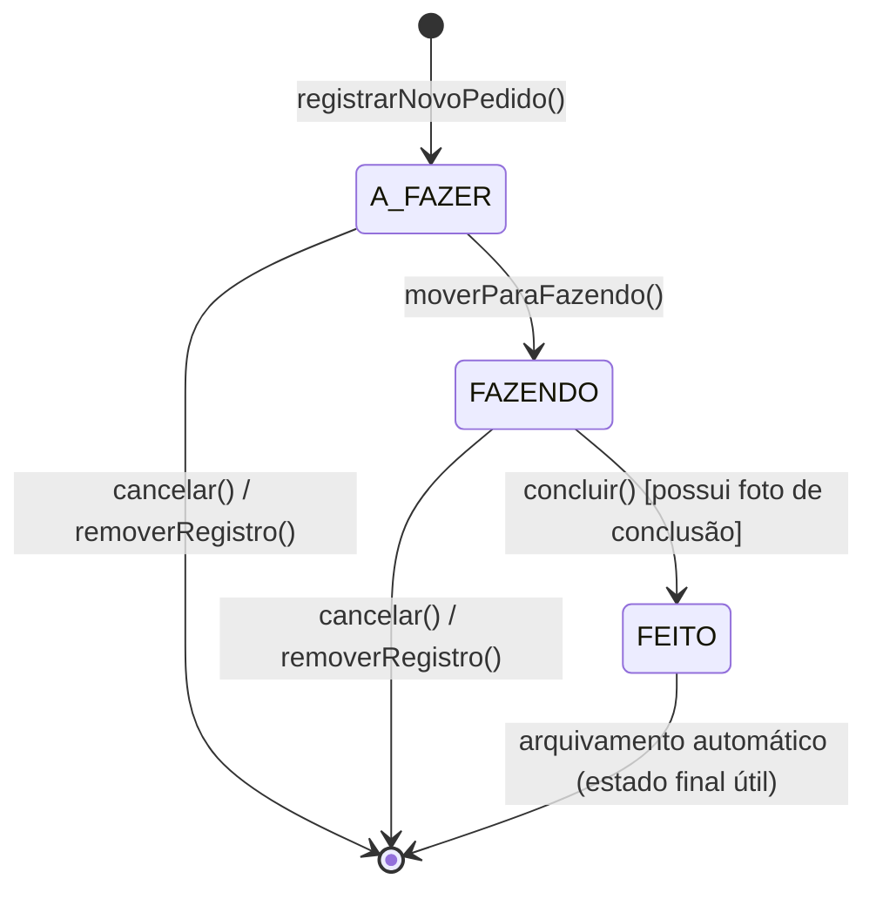

*(base: Etapa 1, Decisão #7; RF03, RF04, RF05, RF20)*

## 5.2 Ciclo de Vida da Obra

Este diagrama detalha as transições do atributo `status_obra` (enum `StatusObra`) da entidade `Obra`.

O fluxo é fortemente bifurcado pelas regras de tipo de obra (RF10):
- Somente obras do tipo `UNICA` transitam pelo estado transitório `RESERVADA` (assumindo exclusividade de um vínculo com Pedido). Quando o pedido associado é concluído, transita para `ENTREGUE`. Se o pedido é cancelado, retorna a `DISPONIVEL` via `liberar()`.
- Obras do tipo `SERIE` operam apenas por manipulação do atributo `quantidade` permanecendo no estado `DISPONIVEL` para múltiplos pedidos (decremento ao vincular, incremento ao cancelar) até serem descontinuadas/arquivadas pelo artesão.

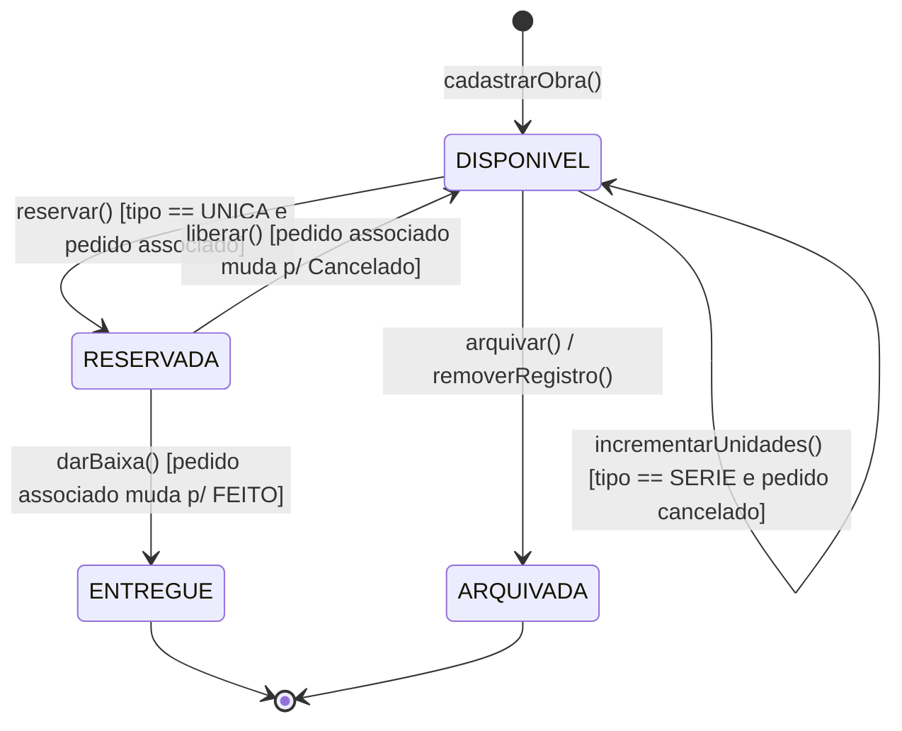

*(base: RF10, RF21, RF22; restrições dos métodos da classe Obra da Seção 3)*

---

# 6. Classes de Fronteira, Controle e Entidade (Boundary-Control-Entity)

Esta etapa reclassifica os elementos levantados até aqui na visão da Análise BCE (Boundary-Control-Entity), preparando o terreno para as camadas de Clean Architecture (Boundary = Interface Adapters / Control = Application / Entity = Domain).

## 6.1 Mapeamento BCE por Caso de Uso Principal

| Caso de Uso (UC) | Boundary (Telas / Triggers) | Control (Use Cases / Services) | Entities Envolvidas |
|------------------|----------------------------|--------------------------------|----------------------|
| UC01 Realizar Login | `TelaLogin` | `AuthUseCase` | `Usuario` (remoto) |
| UC03 Visualizar Kanban | `TelaKanban` | `ConsultarPedidosUseCase` | `Pedido`, `Cliente`, `Obra` |
| UC05 Concluir Pedido | `TelaKanban`, `CameraView` | `ConcluirPedidoUseCase` | `Pedido`, `Obra` |
| UC07 Registrar Novo Pedido | `TelaNovoPedido` | `CadastrarPedidoUseCase` | `Pedido`, `Cliente`, `Obra` |
| UC09 Cadastrar Cliente | `TelaNovoCliente` | `CadastrarClienteUseCase` | `Cliente` |
| UC11 Consultar Estoque | `TelaEstoque` | `ConsultarEstoqueUseCase` | `Obra` |
| UC12 Cadastrar Obra | `TelaNovaObra`, `CameraView` (opcional catálogo) | `CadastrarObraUseCase` | `Obra` |
| UC13 Cadastrar Evento | `TelaNovoEvento`, `MapaView` | `CadastrarEventoUseCase` | `Evento` |
| UC16 Sincronizar Dados | `SyncServiceWorker` (Background) | `SincronizarDadosUseCase` | `FilaSync`, `Pedido`, `Cliente`, `Obra`, `Evento` |
| UC19 Editar Cliente | `TelaEditarCliente` | `EditarClienteUseCase` | `Cliente` |
| UC20 Editar Pedido | `TelaEditarPedido` | `EditarPedidoUseCase` | `Pedido`, `Obra` |
| UC21 Cancelar Pedido | `TelaKanban` | `CancelarPedidoUseCase` | `Pedido`, `Obra` |

*(base: Seções 2 e 3)*

## 6.2 Diagramas de Robustez

Os diagramas abaixo ilustram o fluxo de responsabilidade Ator → Boundary → Control → Entity, simplificando a visualização de quem chama quem.

### Fluxo 1: UC05 Concluir Pedido (Fazendo → Feito)

Demonstra a restrição (RNF11) de uso obrigatório da câmera antes que a lógica de aplicação altere o status da entidade Pedido, que por sua vez altera o status da Obra associada.

> **Nota — diagrama validado** (versão original quebrava o parser por parênteses sem aspas em `|concluir(foto)|`; substituído pela versão validada).

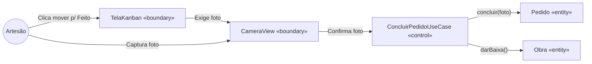

### Fluxo 2: UC07 Registrar Novo Pedido

Demonstra o fluxo de cadastro envolvendo o vínculo com cliente (existente ou novo) e a seleção opcional de uma obra do catálogo.

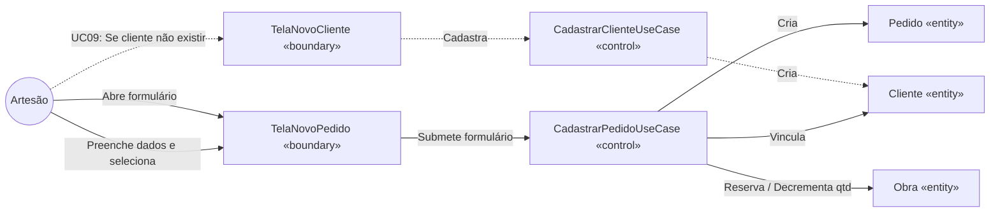

*(base: Seção 2 — Fluxos Alternativos e Inclusões; Seção 3 — Restrições de métodos)*

---

# 7. Diagrama de Sequência

Os diagramas de sequência abaixo expandem a visão de robustez (Seção 6), inserindo a linha do tempo, retornos síncronos, os participantes de infraestrutura (Repositórios e Fila de Sync do SQLite) e os fragmentos de condição (`alt`) que executam as regras de negócio de domínio (TDD/Clean Architecture).

## 7.1 UC05 — Concluir Pedido (Fazendo → Feito)

Demonstra a validação rigorosa da foto e o enfileiramento offline.

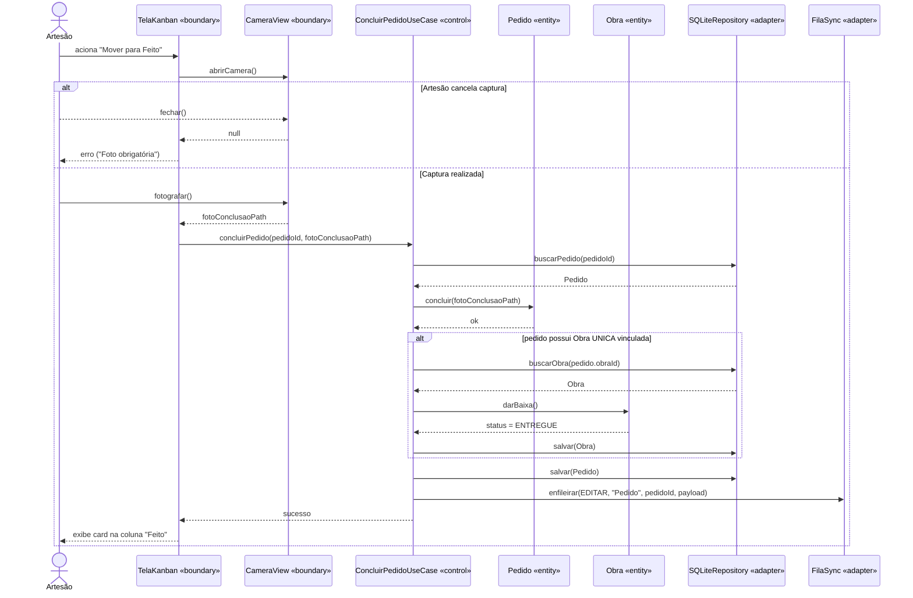

## 7.2 UC07 — Registrar Novo Pedido

Demonstra o cadastro de um pedido com seleção de cliente e a bifurcação de regra de negócio (reserva vs. baixa) dependendo do tipo da obra selecionada do estoque.

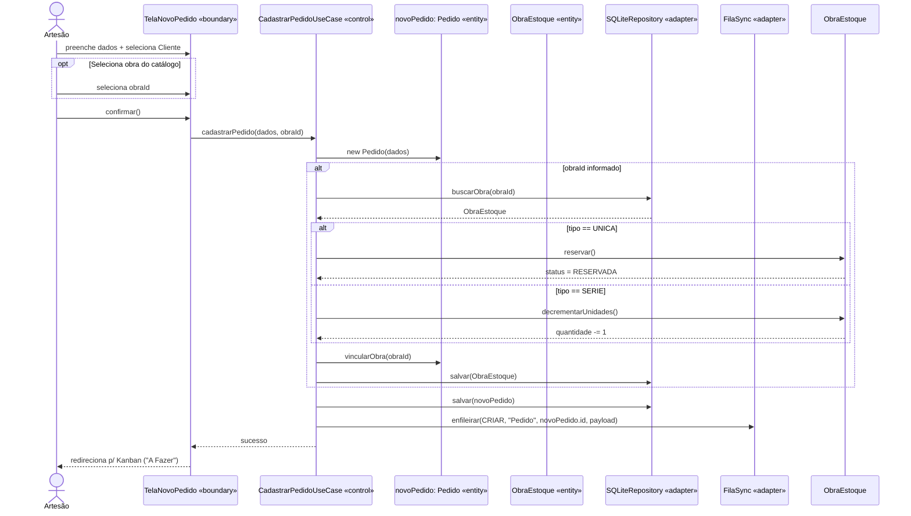

*(base: Seção 2 - fluxos principais; Seção 3 - restrições de métodos; RF05, RF10, RF15)*

---

# 8. Diagrama de Atividades

Para o Diagrama de Atividades, foi escolhido o fluxo mais crítico e complexo do aplicativo: **Operações Offline e Sincronização Automática (UC16 + UC17)**.

O diagrama demonstra o padrão "Offline-First" adotado pelo sistema (RNF02). Ele divide as responsabilidades em raias (swimlanes conceituais) demonstrando como a interface de usuário (UI) não é bloqueada pela rede, e como o processamento em background (worker) se recupera de estados sem conectividade, resolvendo também a dependência de upload de imagens (Storage) antes de atualizar os dados relacionais (Database).

## 8.1 Atividade: Operação e Sincronização Offline-First

> **Nota — diagrama validado** (versão original usava `\n` literal e rótulos com parênteses sem aspas; substituído pela versão validada com `<br/>` e aspas duplas).

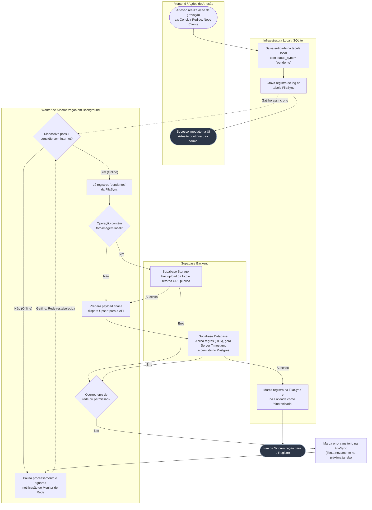

### Análise de Decisões e Paralelismo
- **Desacoplamento UI/Sync:** A passagem `C --> E` garante que a percepção de performance (RNF01) seja atingida independentemente da nuvem.
- **Precedência de Recursos (Storage antes do DB):** O nó `H` demonstra uma orquestração vital: se a operação for concluir um pedido, a imagem é enviada para o Storage (`J`) *antes* de o pedido ser atualizado no Database (`K`). O payload final para o Postgres já deve conter a URL remota obtida no passo anterior.
- **Server Timestamp e Consistência (RNF04):** A gravação oficial na nuvem (`K`) utiliza os timestamps do servidor como verdade. O tempo `criado_em_local` viaja junto apenas para auditoria na UI, não interferindo na cronologia do banco de dados remoto.

*(base: Etapa 1 - Seção 3 e 4; UC16, UC17)*

---

# 9. Diagrama de Componentes

Este diagrama detalha a **arquitetura tecnológica** do sistema (proposta na Etapa 1), separando logicamente as responsabilidades do aplicativo mobile no dispositivo (isolado em camadas via *Clean Architecture*) da infraestrutura em nuvem (BaaS Supabase).

A modelagem enfatiza o caráter "Offline-First", evidenciando que as lógicas de negócio operam diretamente contra a Infraestrutura Local (`SQLite` e `File System`), enquanto um componente assíncrono especializado (`Sync Worker`) faz a ponte entre os Repositórios Locais e as APIs Remotas.

## 9.1 Arquitetura Macro e Integrações

> **Nota — diagrama validado** (versão original usava `\n` literal e rótulos com parênteses sem aspas; substituído pela versão validada com `<br/>` e aspas duplas).

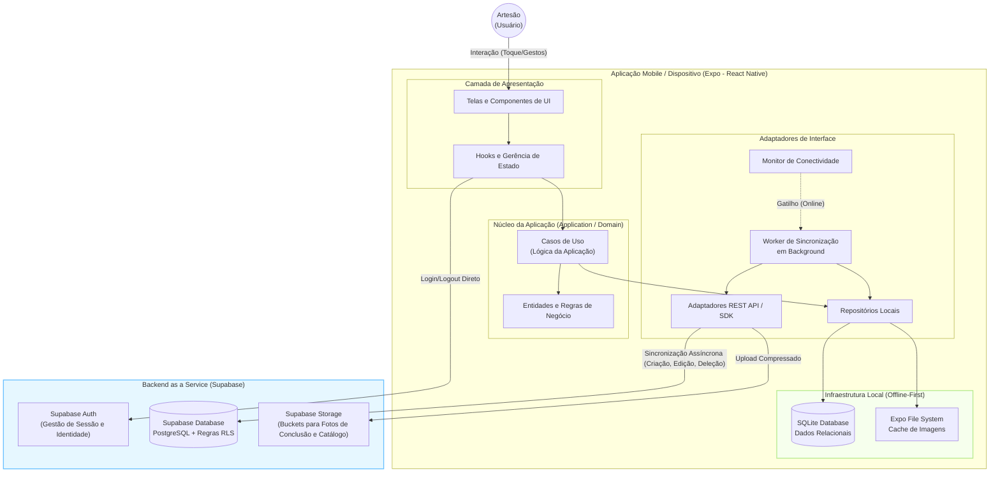

### Componentes Chave

1. **Camada de Apresentação:** React Native com Expo, consumindo os `UseCases` sem conhecer os bancos de dados locais diretamente.
2. **Repositórios Locais (`Repo`):** São a única fonte de verdade síncrona do App. A UI lê e escreve exclusivamente aqui.
3. **Monitor de Conectividade (`NetListener`):** Escuta mudanças no sistema operacional do celular (modo avião, perda de sinal) e sinaliza a UI (para exibir o banner de offline - RF17) ou aciona o `SyncWorker`.
4. **Worker de Sincronização (`SyncWorker`):** Lê a `fila_sync` (dentro do SQLite), compacta as imagens salvas no `FS` e aciona os `SupabaseAdapters`.
5. **PostgreSQL com RLS (`S_DB`):** O backend recebe operações do aplicativo, checa o token de identidade e, baseado no `usuario_id` (`auth.uid()`), permite (ou nega) as transações, garantindo o RNF03.

*(base: Etapa 1 - Seção 2, 3, 4, 5 e 6)*

---

# 10. Implementação: DDD, Clean Architecture, TDD

Para garantir a manutenibilidade (RNF09) e a robustez testável do sistema "Offline-First", as seguintes orientações devem guiar o momento da escrita do código.

## 10.1 Estrutura de Pastas (Clean Architecture)

A organização do projeto deve seguir rigorosamente a separação de responsabilidades. A regra de ouro é: **dependências apontam sempre para o centro** (Domain). A camada `domain` não pode importar ABSOLUTAMENTE NADA de pacotes externos, bibliotecas de UI (React) ou SDKs de banco (Supabase, SQLite).

```text
src/
 ├── core/
 │   ├── domain/               # O coração da aplicação (TDD Primeira fase)
 │   │   ├── entities/         # Classes puras: Obra, Pedido, Cliente (c/ regras de negócio)
 │   │   ├── enums/            # StatusPedido, TipoObra, etc.
 │   │   └── errors/           # Exceções de domínio (ex: ObraInvalidaError)
 │   │
 │   └── application/          # Casos de Uso (TDD Segunda fase)
 │       ├── usecases/         # ConcluirPedidoUseCase, CadastrarObraUseCase
 │       └── repositories/     # Interfaces (contratos) dos repositórios (ex: IPedidoRepository)
 │
 ├── infrastructure/           # Implementação dos contratos (Adapters)
 │   ├── database/
 │   │   ├── sqlite/           # Implementação dos repositórios usando expo-sqlite
 │   │   └── supabase/         # Integração com backend (SupabaseClient)
 │   ├── fileSystem/           # Implementação de compressão/salvamento (expo-file-system)
 │   └── sync/                 # Worker de sincronização e monitor de rede
 │
 ├── presentation/             # React Native / Expo UI
 │   ├── components/           # Componentes visuais "burros" (Botões, Inputs, Cards)
 │   ├── screens/              # Telas conectadas aos Casos de Uso (Kanban, Estoque)
 │   ├── hooks/                # Gerência de estado local / Context API
 │   └── navigation/           # Rotas do app
 │
 └── main/                     # Ponto de entrada e Injeção de Dependência (Factories)
     └── factories/            # Monta os Casos de Uso instanciando os Repositórios reais
```

## 10.2 Orientação para TDD (Test-Driven Development)

A implementação deve ser orientada a testes, começando pelo núcleo e expandindo para as bordas, seguindo esta ordem estrita:

1. **Fase 1: Testes de Entidade (Domain)**
   - Escreva testes para instanciar a entidade `Obra` e verificar os métodos `reservar()`, `decrementarUnidades()`, `incrementarUnidades()` e `adicionarUnidades()`.
   - Assegure que exceções de negócio sejam lançadas ao violar restrições (ex: tentar reservar uma obra do tipo `SERIE` ou tentar concluir `Pedido` sem foto).
2. **Fase 2: Testes de Caso de Uso (Application)**
   - Escreva testes para `ConcluirPedidoUseCase` usando repositórios em memória (mocks criados com Jest).
   - Valide orquestração: se a regra da foto funciona e se `Obra.darBaixa()` é chamada corretamente via caso de uso, verificando se o repositório é chamado no final.
3. **Fase 3: Testes de Repositório (Infrastructure)**
   - Teste as queries do SQLite para operações CRUD.
   - Valide estritamente o gatilho de enfileiramento (garantir a adição do status `pendente` e a inserção na `FilaSync`).

## 10.3 Padrões de Projeto Exigidos

- **Repository Pattern:** O App NUNCA deve fazer queries do SQLite diretamente dentro de Hooks do React ou Telas. A UI chama os *UseCases*, que interagem com as interfaces genéricas dos repositórios.
- **Dependency Injection (Inversão de Dependência):** Instancie o repositório concreto do SQLite na pasta `main/factories/` e injete nos *UseCases* via construtor. Isso permite rodar testes unitários rápidos na camada Application passando *in-memory repositories*.
- **Desacoplamento Offline-First:** As camadas de repositório devem responder imediatamente com sucesso à UI após a gravação local (SQLite). A comunicação de falha ou latência de rede fica encapsulada e isolada apenas no Worker de Sincronização em background.

## 10.4 Checklist para a Fase de Código (Próxima Etapa)

O desenvolvimento deverá ser iniciado respeitando o seguinte fluxo:
- [ ] **1. Setup:** Instanciar o app via Expo (`npx create-expo-app`), configurar TypeScript, ESLint e Jest.
- [ ] **2. Domínio:** Codificar e testar a camada `core/domain` (Entidades e Regras de Negócio).
- [ ] **3. Aplicação:** Codificar e testar a camada `core/application` (Casos de Uso e interfaces).
- [ ] **4. Infra local:** Configurar esquema do SQLite e testes de persistência.
- [ ] **5. Apresentação (UI):** Desenvolver telas e componentes conectando com `main/factories`.
- [ ] **6. Nuvem & Sync:** Configurar projeto Supabase (Tabelas e RLS), implementar Rotina de Sync Worker e SDK Auth.

---

# Apêndice A — Consolidação e Revisão de Escopo Fechado

## A.1 Checklist de 15 itens da skill `software-design-doc`

| # | Item exigido | Presença neste documento | Seção |
|---|--------------|--------------------------|-------|
| 1 | Requisitos funcionais e não funcionais (tabela) | OK — RF01–24, RNF01–11 | 1 |
| 2 | Diagrama de casos de uso com atores (+ herança de ator), include, extend | OK com adaptação registrada — atores Artesão/Monitor/Supabase; `include` (UC05→UC06, UC07→UC08, UC13→UC14, UC16→UC17) e `extend` (UC09→UC08, UC10→UC07); herança de ator não aplicável (usuário único; sem `Administrador` — Decisão #1/#3 registrada em 2.1) | 2 |
| 3 | Descrição textual dos casos de uso principais | OK — UC01, UC05, UC07, UC12, UC13, UC16 com ator, pré-condição, fluxo principal, alternativos, pós-condição | 2.4 |
| 4 | Diagrama de classes com composição, agregação, herança e multiplicidades | OK — associação `Usuario--`, associação `Cliente--Pedido`, `Pedido-->Obra`, enums; agregação/herança genérica não se aplicam a este domínio (registrado em 3.1: `ItemPedido`/`Pagamento` descartados com justificativa) | 3.1 |
| 5 | Marcação de persistência das entidades | OK — tabela completa (UUID v4 client-generated) + `created_at_local` transversal | 3.2 |
| 6 | DER — feito se houver entidade persistente, dispensado com registro se não | OK — feito (5 tabelas: `CLIENTE`, `PEDIDO`, `OBRA`, `EVENTO` + `FILA_SYNC` local) | 3.3 |
| 7 | Diagrama de objetos validando cardinalidades/relações | OK — snapshot usuario1/clienteJoao/pedidos/obras + validação | 4 |
| 8 | Diagrama de estados — perguntado sobre ciclo complexo; feito ou dispensado com registro | OK — feito para 2 entidades com ciclo complexo (`Pedido`, `Obra` com compensação `incrementarUnidades`); demais entidades sem ciclo complexo (dispensadas por não se aplicar) | 5 |
| 9 | Classes BCE mapeadas por caso de uso | OK — tabela 12 linhas UC→Boundary→Control→Entities | 6.1 |
| 10 | Diagrama de sequência dos casos de uso principais | OK — UC05 e UC07 com lifelines, `alt`/`opt`, retornos | 7 |
| 11 | Diagrama(s) de atividade para fluxos principais | OK — UC16+UC17 offline-first com decisão, raias via subgraphs | 8 |
| 12 | Diagrama de componentes (camadas Clean) | OK — subgraphs Presentation/Application-Domain/Adapters/LocalInfra + Supabase; regra de dependência documentada | 9 |
| 13 | Mapeamento DDD (aggregates, entidades, value objects, repositories) | OK — entities/enums/errors, repositories por aggregate root, linguagem ubíqua; aggregates implícitos (`Pedido`, `Obra` como raízes; `ItemPedido` inexistente neste domínio); sem Value Objects nomeados além dos enums (nenhum VO complexo identificado) | 10 |
| 14 | Estrutura de camadas Clean (domain/application/adapters/infra) | OK — árvore `src/` + regra de dependência para o centro | 10.1 |
| 15 | Plano de testes TDD por caso de uso (unidade domínio → use case → integração) | OK — Fase 1 entidade (inclui `incrementarUnidades`), Fase 2 use case com in-memory repo, Fase 3 SQLite/FilaSync | 10.2–10.4 |

## A.2 Numeração de seções

Sequencial e sem duplicidade: 1, 2, 3, 3.3 (DER dentro de Classes), 4, 5, 6, 7, 8, 9, 10 + Apêndice A.

## A.3 Rastreabilidade RF → UC → BCE → Sequência → Teste

- Todo RF01–24 possui pelo menos um UC na tabela 2.3 (cobertura total verificada).
- UCs principais (UC01, UC03, UC05, UC07, UC09, UC11, UC12, UC13, UC16, UC19, UC20, UC21) estão na tabela BCE 6.1 com mesmos nomes de Boundary/Control/Entity.
- UC05 e UC07 (fluxos críticos com regra rígida) possuem sequência em 7.1–7.2 com mesmos participantes da Seção 6 e mesma ordem de chamada que vira teste de use case.
- Entities da Seção 3 aparecem em BCE (6.1), sequência (7), DER (3.3) e objetos (4).
- Testes da Seção 10 cobrem domínio (`Obra.reservar`, `Pedido.concluir` sem foto, `incrementarUnidades`), aplicação (`ConcluirPedidoUseCase` + `darBaixa`) e infra (CRUD SQLite + `fila_sync pendente`); cada RF é rastreável a pelo menos um nível de teste via UC de origem.
- IDs RF/UC renumerados sequencialmente após remoção de Histórico de Preços e Foto de Referência; nomes de métodos (`concluir`, `darBaixa`, `reservar`, `decrementarUnidades`, `incrementarUnidades`), enums e tabelas mantidos consistentes.

## A.4 Revisão de escopo fechado aplicada

1. **Removido Histórico de Preços:** RFs, UC14/UC15/UC27 originais, classe `HistoricoPreco`, tabelas `historico_*`, tela e use case deletados (Corte A).
2. **Removida Foto de Referência:** RF08/UC10 originais deletados; mantida Foto de Conclusão obrigatória UC05/UC06 (Corte B).
3. **Removida entidade `Negocio`:** escopo direto por `usuario_id` UUID; RLS por `auth.uid()`; DER e classes atualizados; IDs UUID v4 client-generated nos dois lados.
4. **Removida linguagem de futuro/v1.1/v2:** escopo fechado de 6 meses sem entregas futuras; tabela Fora do MVP deletada na Etapa 1.
5. **Sintaxe Mermaid:** rótulos com parênteses/`/` entre aspas duplas, `<br/>` em vez de `\n`, blocos `alt/opt/end` balanceados, `erDiagram` com tipos minúsculos e PK/FK.
6. **Correções de referência:** `UC08 → RF07`, `Decisão #11 → #1/#3`, `RNF12 → RNF11`, compensação `SERIE` no cancelamento, modo degradado do mapa offline.
