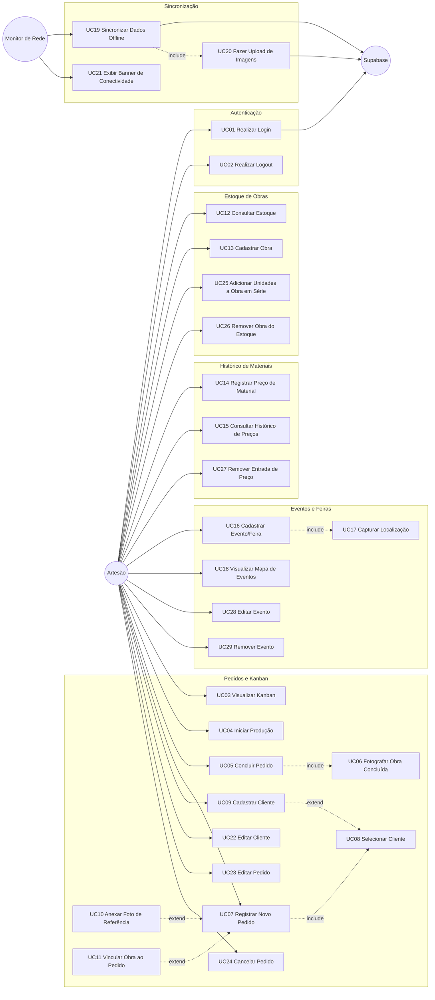

# Tarefa 2 — Diagrama de Casos de Uso + Descrições Textuais
## App de Gestão para Artesãos

---

## 2.1 Atores

| Ator | Tipo | Descrição |
|------|------|-----------|
| **Artesão** | Primário | Único usuário do sistema no MVP; inicia todos os casos de uso interativos *(base: Etapa 1, Seção 1 / Decisão #11)* |
| **Monitor de Rede** | Sistema (evento) | Listener interno que detecta mudanças de conectividade e dispara sync e banner *(base: Etapa 1, Seção 6)* |
| **Supabase** | Secundário externo | Plataforma de backend — Auth, banco de dados e Storage; participa de login e sincronização *(base: Etapa 1, Seção 4)* |

> Não há ator `Administrador` no MVP — o app suporta um único usuário por negócio *(base: Etapa 1, Decisão #11)*.

---

## 2.2 Diagrama de Casos de Uso

### Legenda de relações

| Notação | Semântica |
|---------|-----------|
| `──►` sólida | Ator inicia o caso de uso |
| `-. include .-►` tracejada | Comportamento obrigatório, sempre executado como parte do caso base |
| `-. extend .-►` tracejada | Comportamento opcional/condicional, insere-se quando a condição de extensão é satisfeita |

---

## 2.3 Mapeamento UC ↔ RF

| Caso de Uso | RFs Atendidos |
|-------------|--------------|
| UC01 Realizar Login | RF01 |
| UC02 Realizar Logout | RF02 |
| UC03 Visualizar Kanban | RF03 |
| UC04 Iniciar Produção | RF04 |
| UC05 Concluir Pedido | RF04, RF05 |
| UC06 Fotografar Obra Concluída | RF05 |
| UC07 Registrar Novo Pedido | RF07, RF17 |
| UC08 Selecionar Cliente | RF06 |
| UC09 Cadastrar Cliente | RF06, RF17 |
| UC10 Anexar Foto de Referência | RF08 |
| UC11 Vincular Obra ao Pedido | RF11, RF12 |
| UC12 Consultar Estoque de Obras | RF09, RF17 |
| UC13 Cadastrar Obra no Estoque | RF10, RF17 |
| UC14 Registrar Preço de Material | RF13, RF17 |
| UC15 Consultar Histórico de Preços | RF14, RF17 |
| UC16 Cadastrar Evento/Feira | RF15 |
| UC17 Capturar Localização | RF15 |
| UC18 Visualizar Mapa de Eventos | RF16 |
| UC19 Sincronizar Dados Offline | RF18 |
| UC20 Fazer Upload de Imagens | RF19 |
| UC21 Exibir Banner de Conectividade | RF20 |
| UC22 Editar Cliente | RF21 |
| UC23 Editar Pedido | RF22 |
| UC24 Cancelar Pedido | RF23 |
| UC25 Adicionar Unidades a Obra em Série | RF24 |
| UC26 Remover Obra do Estoque | RF25 |
| UC27 Remover Entrada de Preço de Material | RF26 |
| UC28 Editar Evento | RF27 |
| UC29 Remover Evento | RF28 |

---

## 2.4 Descrições Textuais dos Casos de Uso Principais

---

### UC01 — Realizar Login

**Ator primário:** Artesão  
**Ator secundário:** Supabase (Auth)  
**Pré-condições:**
- Artesão possui conta cadastrada no Supabase Auth.
- App instalado e com conectividade (login exige rede).

**Fluxo principal:**
1. Artesão abre o app e é redirecionado para a tela de Login (rota pública).
2. Artesão informa e-mail e senha.
3. App envia credenciais ao Supabase Auth.
4. Supabase valida e retorna token de sessão.
5. App persiste token localmente e redireciona para a área protegida (Bottom Tabs: Kanban, Estoque, Eventos).

**Fluxos alternativos:**
- **FA1 — Credenciais inválidas:** Supabase retorna erro; app exibe mensagem "E-mail ou senha incorretos"; fluxo retorna ao passo 2.
- **FA2 — Sem conectividade:** App detecta ausência de rede antes do envio; exibe aviso "Sem conexão — login requer internet"; bloqueia o passo 3.
- **FA3 — Sessão já ativa:** Se token válido já persistido, app pula para o passo 5 sem exibir a tela de login.

**Pós-condições:**
- Artesão autenticado; token de sessão disponível para requisições subsequentes.
- Dados locais do SQLite ficam disponíveis para operações offline imediatas.

*(base: Etapa 1, Seção 4 / RF01)*

---

### UC05 — Concluir Pedido (Fazendo → Feito)

**Ator primário:** Artesão  
**Pré-condições:**
- Pedido existe no sistema com status `Fazendo`.
- Câmera do dispositivo disponível e com permissão concedida.

**Fluxo principal:**
1. Artesão acessa o Kanban e localiza o card do pedido na coluna "Fazendo".
2. Artesão aciona "Mover para Feito".
3. **[include UC06]** Sistema abre a câmera e solicita que o artesão fotografe a obra concluída.
4. Artesão captura a foto.
5. App comprime a imagem e a salva localmente (`expo-file-system`) vinculada ao pedido.
6. Sistema atualiza o status do pedido para `Feito` no SQLite com `status_sync = 'pendente'`.
7. Card move-se visualmente para a coluna "Feito".
8. Se conectado, a fila de sync é processada imediatamente (UC19 → UC20).

**Fluxos alternativos:**
- **FA1 — Artesão cancela a câmera:** Sistema aborta a operação; status do pedido permanece `Fazendo`; exibe aviso "Foto obrigatória para concluir o pedido." *(regra rígida, sem bypass — base: Etapa 1, Decisão #7 / RNF12)*.
- **FA2 — Câmera sem permissão:** App exibe diálogo de solicitação de permissão; se negada, operação é abortada com aviso de instrução para habilitar nas configurações do dispositivo.
- **FA3 — Offline:** Passo 6 salva localmente; passo 8 não ocorre; enfileiramento para sync posterior.

**Pós-condições:**
- Pedido no status `Feito`.
- Imagem da obra concluída persistida localmente e associada ao pedido.
- Se obra vinculada for do tipo `unica`, seu status no estoque é atualizado para `Entregue`.

*(base: Etapa 1, Seção 5 / Decisão #7 / RF04, RF05)*

---

### UC07 — Registrar Novo Pedido

**Ator primário:** Artesão  
**Pré-condições:**
- Artesão autenticado.
- (Opcional) Cliente já cadastrado no sistema.

**Fluxo principal:**
1. Artesão aciona "Novo Pedido" (via FAB no Kanban ou menu de navegação).
2. App exibe formulário de novo pedido com campos: canal de origem, descrição, data de entrega.
3. Artesão seleciona o canal de origem (Instagram / WhatsApp / Presencial / Telefone / Outros).
4. **[include UC08]** Artesão seleciona o cliente vinculado ao pedido.
5. Artesão preenche descrição e data de entrega.
6. Artesão confirma o cadastro.
7. App persiste o pedido no SQLite com status `A Fazer` e `status_sync = 'pendente'`.
8. Card aparece na coluna "A Fazer" do Kanban.

**Fluxos alternativos:**
- **FA1 — Cliente não encontrado em UC08:** Sistema oferece ação "Cadastrar novo cliente"; **[extend UC09]** artesão cadastra o cliente; fluxo retorna ao passo 4 com o novo cliente selecionado.
- **FA2 — Artesão anexa foto de referência:** **[extend UC10]** Artesão aciona "Adicionar foto de referência"; câmera é aberta; foto capturada e comprimida é vinculada ao pedido.
- **FA3 — Artesão vincula obra do estoque:** **[extend UC11]** Artesão aciona "Vincular obra"; seleciona obra disponível no estoque; sistema aplica baixa conforme tipo (`unica` → Reservada; `serie` → decremento de quantidade).
- **FA4 — Offline:** Fluxo ocorre integralmente; dados persistidos localmente; sync ocorre quando rede for restabelecida.

**Pós-condições:**
- Pedido criado com status `A Fazer`, vinculado a um cliente.
- Card exibido na coluna "A Fazer" do Kanban.
- (Se FA2) Foto de referência salva localmente e associada ao pedido.
- (Se FA3) Baixa de estoque aplicada conforme tipo da obra.

*(base: Etapa 1, Seção 1 / Seção 3 / RF06, RF07, RF08, RF11, RF12, RF17)*

---

### UC13 — Cadastrar Obra no Estoque

**Ator primário:** Artesão  
**Pré-condições:**
- Artesão autenticado.

**Fluxo principal:**
1. Artesão acessa a tela de Estoque e aciona "Nova Obra".
2. App exibe formulário com campos: nome, tipo (`Única` ou `Em Série`), foto.
3. Artesão preenche o nome e seleciona o tipo.
4. Se tipo = `Em Série`: campo `quantidade` fica obrigatório e visível; artesão informa a quantidade de unidades.
5. (Opcional) Artesão fotografa a obra para o catálogo.
6. Artesão confirma o cadastro.
7. App persiste a obra no SQLite com status inicial `Disponível` e `status_sync = 'pendente'`.
8. Obra aparece na lista de estoque.

**Fluxos alternativos:**
- **FA1 — Tipo `Única`:** Campo `quantidade` oculto/fixado em 1; sem alteração no fluxo.
- **FA2 — Artesão não fotografa:** Obra cadastrada sem foto; ação opcional.
- **FA3 — Offline:** Persiste localmente; sync posterior.

**Pós-condições:**
- Obra disponível no estoque com status `Disponível`.
- Para obras em série: `quantidade > 0`.
- Para obras únicas: disponível para vinculação a um único pedido.

*(base: Etapa 1, Seção 3 / Decisão #8 / RF10)*

---

### UC16 — Cadastrar Evento/Feira

**Ator primário:** Artesão  
**Pré-condições:**
- Artesão autenticado.
- GPS do dispositivo disponível (ou possibilidade de seleção manual no mapa).

**Fluxo principal:**
1. Artesão acessa a tela de Mapa de Eventos e aciona "Novo Evento".
2. App exibe formulário: nome, data, endereço textual, observações.
3. Artesão preenche nome e data.
4. **[include UC17]** App solicita captura de localização: exibe mapa com pin arrastável e opção de usar GPS atual; artesão confirma o ponto.
5. Artesão preenche endereço textual (complemento descritivo) e observações (opcional).
6. Artesão confirma o cadastro.
7. App persiste o evento no SQLite com `status_sync = 'pendente'`.
8. Pin do evento aparece no mapa.

**Fluxos alternativos:**
- **FA1 — GPS indisponível/negado:** App permite posicionamento manual do pin diretamente no mapa; fluxo continua.
- **FA2 — Offline:** Persiste localmente; sync posterior (mapa exibe pins dos eventos locais normalmente).

**Pós-condições:**
- Evento registrado com nome, data, coordenadas, endereço e observações.
- Pin visível no mapa da tela de Eventos.

*(base: Etapa 1, Seção 5 / Passo 0 - A5 / RF15, RF16)*

---

### UC19 — Sincronizar Dados Offline

**Ator primário:** Monitor de Rede (sistema)  
**Atores secundários:** Supabase (banco de dados), Supabase Storage  
**Pré-condições:**
- Existem registros com `status_sync = 'pendente'` na fila local do SQLite.
- Conexão com a internet foi restabelecida (evento detectado pelo listener de rede).

**Fluxo principal:**
1. Monitor de Rede detecta restauração da conectividade.
2. App aciona o serviço de sincronização em segundo plano (sem interromper a navegação do artesão).
3. **[include UC20]** App identifica imagens pendentes de upload; comprime e faz upload para o Supabase Storage; obtém URLs públicas.
4. App lê a fila de operações pendentes (criação/edição de pedidos, clientes, obras, eventos, preços).
5. Para cada operação, app realiza o upsert no Supabase via API, usando o server timestamp gerado pelo Supabase como timestamp oficial do registro.
6. Registro atualizado com `status_sync = 'sincronizado'` no SQLite local.
7. URLs das imagens retornadas pelo Storage são gravadas nos registros correspondentes.

**Fluxos alternativos:**
- **FA1 — Conexão perdida durante sync:** Operações já enviadas são marcadas como `sincronizado`; operações pendentes permanecem na fila; sync retoma quando a rede retornar.
- **FA2 — Erro de upload de imagem:** Operação de imagem retorna para a fila com tentativa futura; não bloqueia sync dos demais registros.
- **FA3 — Fila vazia:** Serviço de sync é acionado mas não executa operações; finaliza silenciosamente.

**Pós-condições:**
- Todos os registros com `status_sync = 'pendente'` foram enviados ao Supabase ou mantidos na fila para nova tentativa.
- Timestamps oficiais (server timestamp) gravados nos registros sincronizados.
- `created_at_local` preservado como metadado separado para rastreabilidade *(base: Etapa 1, Seção 4 / Decisão #2 / RNF04)*.

*(base: Etapa 1, Seção 3 / Seção 4 / RF18, RF19)*
