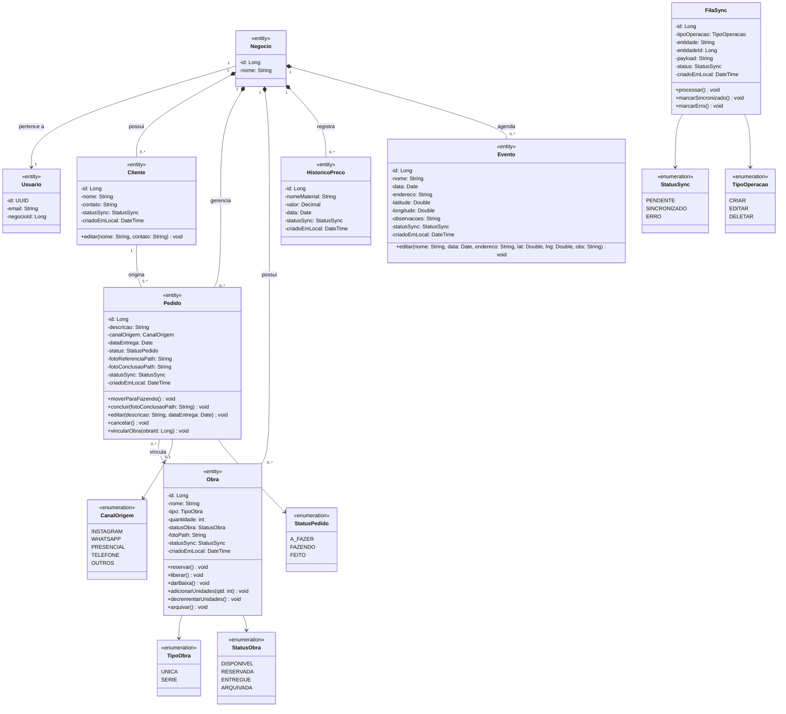

# Tarefa 3 — Diagrama de Classes + Tabela de Persistência
## App de Gestão para Artesãos

---

## 3.1 Diagrama de Classes

### Extração de candidatos a classes

Substantivos dos casos de uso e requisitos:

| Substantivo | Classe candidata | Descartado? |
|-------------|-----------------|-------------|
| Artesão / Usuário | `Usuario` | Não |
| Negócio / Workspace | `Negocio` | Não (RNF10) |
| Cliente | `Cliente` | Não |
| Pedido / Encomenda | `Pedido` | Não |
| Obra / Escultura | `Obra` | Não |
| Preço de Material | `HistoricoPreco` | Não |
| Evento / Feira | `Evento` | Não |
| Fila de Sync | `FilaSync` | Não (infraestrutura) |
| Canal de Origem | `CanalOrigem` | Enum — embutido em `Pedido` |
| Status do Pedido | `StatusPedido` | Enum — embutido em `Pedido` |
| Tipo de Obra | `TipoObra` | Enum — embutido em `Obra` |
| Status da Obra | `StatusObra` | Enum — embutido em `Obra` |
| Status de Sync | `StatusSync` | Enum transversal |
| Item de Pedido | — | **Descartado**: pedido tem exatamente 1 obra opcional; sem lista de itens neste domínio |
| Pagamento | — | **Descartado**: fora do MVP v1 *(base: Etapa 1, Seção 7)* |

---

### Notas sobre relações

| Relação | Tipo | Justificativa |
|---------|------|---------------|
| `Negocio *-- Cliente/Pedido/Obra/HistoricoPreco/Evento` | Composição | Dados não existem sem o `Negocio`; exclusão do negócio implica exclusão em cascata *(base: RNF10)* |
| `Negocio --> Usuario` | Associação 1–1 (MVP) | Arquitetura permite 1–N no futuro; cardinalidade reflete apenas o MVP *(base: Etapa 1, Decisão #3)* |
| `Cliente -- Pedido` | Associação 1–0..* | Pedido pertence a um cliente; cliente pode existir sem pedidos |
| `Pedido --> Obra` | Associação 0..*–0..1 | Pedido pode ou não estar vinculado a uma obra do estoque; para `UNICA`, regra de negócio em `Obra.reservar()` limita a 1 vínculo ativo; para `SERIE`, múltiplos pedidos podem referenciar a mesma obra |

### Restrições de negócio nos métodos de `Obra`

| Método | Regra |
|--------|-------|
| `reservar()` | Válido somente se `tipo = UNICA` e `statusObra = DISPONIVEL`; lança exceção caso contrário |
| `liberar()` | Válido somente se `tipo = UNICA` e `statusObra = RESERVADA` |
| `darBaixa()` | Válido somente se `tipo = UNICA`; muda `statusObra` para `ENTREGUE` |
| `decrementarUnidades()` | Válido somente se `tipo = SERIE` e `quantidade > 0` |
| `adicionarUnidades(qtd)` | Válido somente se `tipo = SERIE` e `qtd > 0` *(base: Passo 0 - A2 / RF24)* |
| `arquivar()` | Bloqueado se obra está vinculada a pedido com `status != FEITO` *(base: RF25)* |

### Restrições de negócio nos métodos de `Pedido`

| Método | Regra |
|--------|-------|
| `moverParaFazendo()` | Válido somente se `status = A_FAZER` |
| `concluir(fotoConclusaoPath)` | Válido somente se `status = FAZENDO` e `fotoConclusaoPath` não nulo/vazio *(regra rígida — base: Etapa 1, Decisão #7 / RNF12)* |
| `editar(...)` | Válido somente se `status = A_FAZER` *(base: RF22)* |
| `cancelar()` | Disponível em qualquer status, com confirmação explícita; dispara `Obra.liberar()` se obra `UNICA` estiver vinculada *(base: RF23)* |
| `vincularObra(obraId)` | Válido somente se `status = A_FAZER`; delega regra de baixa ao tipo da obra |

---

## 3.2 Tabela de Persistência

| Classe | Persistente? | Estratégia | Observação |
|--------|-------------|-----------|------------|
| `Negocio` | Sim | SQLite: `negocios`; Supabase: `negocios`; PK `id` BIGINT | Scoping de todos os dados do artesão *(base: RNF10)* |
| `Usuario` | Sim (parcial) | Gerenciado pelo Supabase Auth (`auth.users`); tabela `profiles` no Supabase com FK para `auth.users.id` (UUID); **somente remota** — não replicada no SQLite local | ID = UUID do Supabase Auth *(base: Etapa 1, Seção 4)* |
| `Cliente` | Sim | SQLite: `clientes`; Supabase: `clientes`; PK `id`, FK `negocio_id` | Offline-first *(base: Etapa 1, Seção 3)* |
| `Pedido` | Sim | SQLite: `pedidos`; Supabase: `pedidos`; PK `id`, FK `cliente_id`, FK `obra_id` (nullable), FK `negocio_id` | Fotos: path local (`foto_referencia_path`, `foto_conclusao_path`) + URL remota pós-sync (`foto_referencia_url`, `foto_conclusao_url`) *(base: Etapa 1, Seção 5)* |
| `Obra` | Sim | SQLite: `estoque_obras`; Supabase: `obras`; PK `id`, FK `negocio_id`; colunas `tipo` (enum string), `quantidade` INT, `status_obra` (enum string) *(base: Etapa 1, Seção 3 / Decisão #8)* | Foto: path local + URL remota pós-sync |
| `HistoricoPreco` | Sim | SQLite: `historico_materiais_precos`; Supabase: `historico_materiais`; PK `id`, FK `negocio_id` | Append-only por padrão; exclusão pontual possível *(base: Passo 0 - A1 / RF26)* |
| `Evento` | Sim | SQLite: `eventos`; Supabase: `eventos`; PK `id`, FK `negocio_id`; colunas `latitude` DOUBLE, `longitude` DOUBLE *(base: Etapa 1, Seção 5)* | — |
| `FilaSync` | Sim (local only) | SQLite: `fila_sync`; **não replicada no Supabase** — tabela de controle interno de sync; colunas `tipo_operacao`, `entidade`, `entidade_id`, `payload` JSON, `status` enum string, `criado_em_local` | *(base: Etapa 1, Seção 3)* |
| `CanalOrigem` | Não (enum) | Coluna `canal_origem` TEXT em `pedidos`; valores: `INSTAGRAM`, `WHATSAPP`, `PRESENCIAL`, `TELEFONE`, `OUTROS` | *(base: Passo 0 - A3 / RF07)* |
| `StatusPedido` | Não (enum) | Coluna `status` TEXT em `pedidos`; valores: `A_FAZER`, `FAZENDO`, `FEITO` | — |
| `TipoObra` | Não (enum) | Coluna `tipo` TEXT em `estoque_obras` / `obras`; valores: `UNICA`, `SERIE` | *(base: Etapa 1, Decisão #8)* |
| `StatusObra` | Não (enum) | Coluna `status_obra` TEXT em `estoque_obras` / `obras`; valores: `DISPONIVEL`, `RESERVADA`, `ENTREGUE`, `ARQUIVADA` | `RESERVADA` válido somente para `tipo = UNICA` |
| `StatusSync` | Não (enum) | Coluna `status_sync` TEXT em todas as tabelas offline-first; valores: `PENDENTE`, `SINCRONIZADO`, `ERRO` | *(base: Etapa 1, Seção 3)* |
| `TipoOperacao` | Não (enum) | Coluna `tipo_operacao` TEXT em `fila_sync`; valores: `CRIAR`, `EDITAR`, `DELETAR` | — |

### Campo `created_at_local` (transversal)

Todas as tabelas offline-first (`clientes`, `pedidos`, `estoque_obras`, `historico_materiais_precos`, `eventos`) possuem a coluna `created_at_local DATETIME` preenchida pelo dispositivo no momento da criação. Usada **exclusivamente para rastreabilidade** — não substitui o server timestamp como critério de desempate em conflitos *(base: Etapa 1, Seção 4 / Decisão #2 / RNF04)*.
