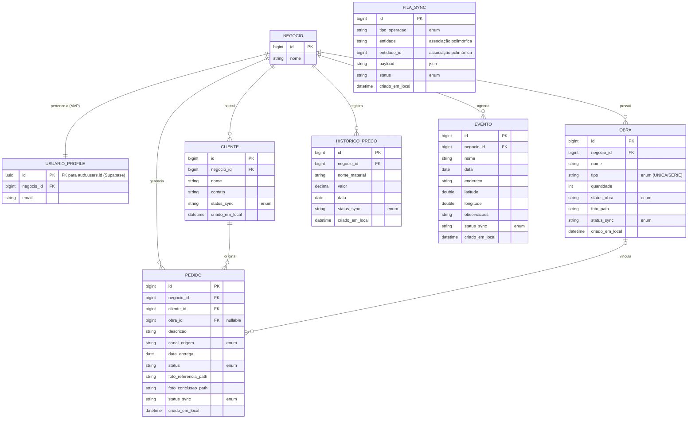

# Tarefa 4 — Diagrama Entidade-Relacionamento (DER)
## App de Gestão para Artesãos

---

## 4.1 Diagrama DER (Visão Relacional)

Este diagrama materializa a visão relacional do banco de dados (SQLite local e Supabase remoto), derivada da Tabela de Persistência (Tarefa 3.2). 

As cardinalidades foram estritamente alinhadas com as multiplicidades do Diagrama de Classes (Tarefa 3.1):
- `Negocio` possui relação `1:N` forte com as entidades operacionais, estabelecendo o escopo de permissões (RLS no Supabase).
- `Cliente` possui `1:N` com `Pedido`.
- `Obra` possui `1:N` opcional com `Pedido` (no banco, materializado como a chave estrangeira nula `obra_id` na tabela `PEDIDO`), já que obras em série podem estar em vários pedidos e um pedido não obrigatoriamente tem uma obra desde o momento da criação.
- `FilaSync` é uma tabela estritamente local (sem contraparte no Supabase) e se relaciona com as demais entidades de forma polimórfica (via `entidade` + `entidade_id`), sem restrição de chave estrangeira (FK) estrita no nível do banco.
- Valores enumerados (`CanalOrigem`, `StatusPedido`, etc.) foram persistidos como colunas descritivas (strings) dentro de suas respectivas tabelas.

*(base: Etapa 1, Seções 3 e 4; restrições derivadas da Tarefa 3)*
