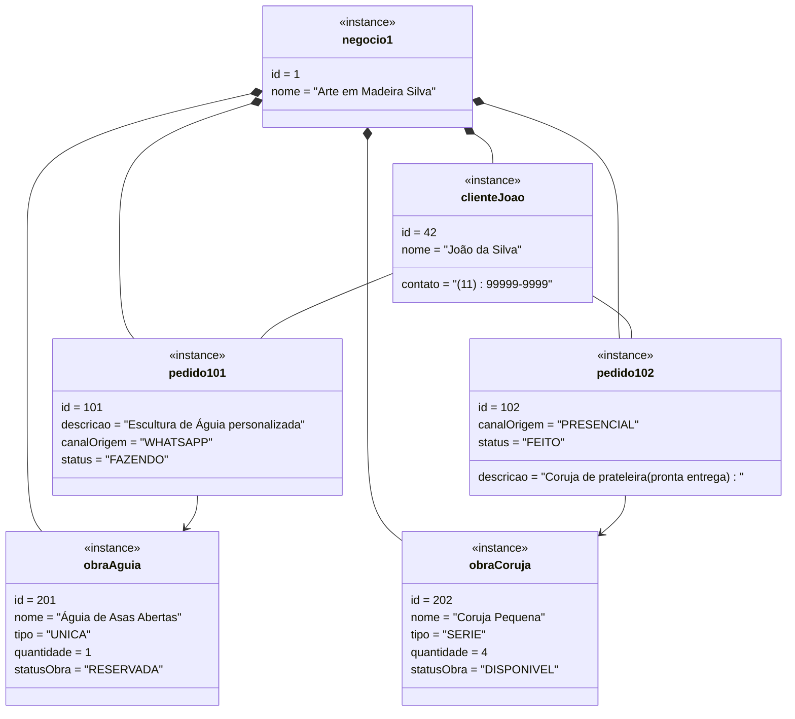

# Tarefa 5 — Diagrama de Objetos
## App de Gestão para Artesãos

---

## 5.1 Diagrama de Instâncias (Snapshot)

Este diagrama representa um instantâneo (snapshot) em tempo de execução do sistema, materializando as classes definidas na Tarefa 3.

**Cenário ilustrado:** 
O negócio "Arte em Madeira Silva" (`negocio1`) possui um cliente cadastrado (`clienteJoao`) que realizou dois pedidos.
- O `pedido101` (A Fazer/Fazendo) está vinculado a uma obra exclusiva (`obraAguia`), cujo tipo é `UNICA`. Por conta desse vínculo ativo, o status da obra reflete `RESERVADA`.
- O `pedido102` (Feito) foi uma venda presencial de uma obra repetível (`obraCoruja`), do tipo `SERIE`. A obra continua com status `DISPONIVEL` e a quantidade restante é 4, pois a baixa do estoque nesse tipo ocorre por decremento da quantidade, não por retenção de estado.

### Validação de Cardinalidades e Relações

- A **composição** `Negocio *-- [Entidades]` prova que todos os registros estão atrelados ao espaço (tenant) do artesão, satisfazendo o isolamento de dados do MVP (RNF03, RNF10).
- A **associação** `Cliente -- Pedido` demonstra que um cliente pode originar vários pedidos distintos simultaneamente (associação 1 para muitos do lado do Cliente).
- A **associação** `Pedido --> Obra` (1 para 0..1 do lado do Pedido) reflete corretamente que o Pedido aponta para a obra, com o modelo suportando as distinções vitais das regras de negócio (Passo 0 - A2): obras únicas seguram seu status em `RESERVADA`, enquanto obras em série apenas operam por decremento da `quantidade` e continuam `DISPONIVEL` para outros pedidos.

*(base: Tarefa 3, Tarefa 4 e validações estruturais do Passo 0)*
