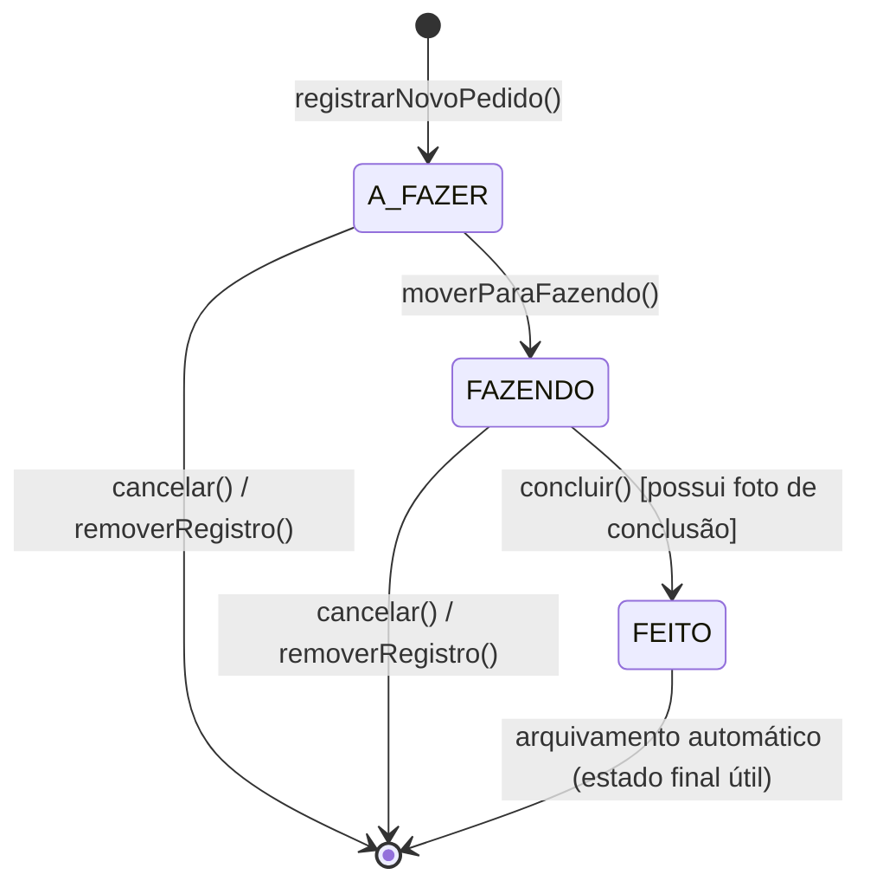
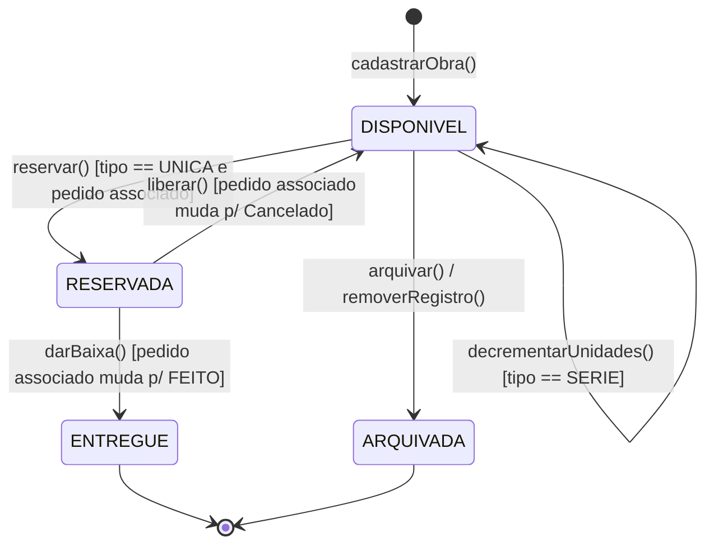

# Tarefa 6 — Diagrama de Estados
## App de Gestão para Artesãos

---

Conforme definido nas etapas anteriores (Passo 0, Tabela de Persistência e regras de negócio da Tarefa 3), duas entidades deste domínio possuem um ciclo de vida complexo o suficiente para justificar a modelagem detalhada de estados: **Pedido** e **Obra**.

## 6.1 Ciclo de Vida do Pedido

Este diagrama detalha as transições do atributo `status` (enum `StatusPedido`) da entidade `Pedido`.

A regra rígida documentada (RF05 / RNF12 / Decisão #7 da Etapa 1) — exigência obrigatória de fotografia da obra concluída — atua como a **condição de guarda** (`[possui foto de conclusão]`) na transição de `FAZENDO` para `FEITO`. O cancelamento (RF23) encerra a vida do objeto, levando-o ao estado final (deleção física ou deleção lógica não visível).

*(base: Etapa 1, Decisão #7; RF03, RF04, RF05, RF23)*

---

## 6.2 Ciclo de Vida da Obra

Este diagrama detalha as transições do atributo `status_obra` (enum `StatusObra`) da entidade `Obra`.

O fluxo é fortemente bifurcado pelas regras de tipo de obra (RF11 / Passo 0 - A2):
- Somente obras do tipo `UNICA` transitam pelo estado transitório `RESERVADA` (assumindo exclusividade de um vínculo com Pedido). Quando o pedido associado é concluído, transita para `ENTREGUE`. Se o pedido é cancelado, retorna a `DISPONIVEL`.
- Obras do tipo `SERIE` operam apenas por manipulação do atributo `quantidade` permanecendo no estado `DISPONIVEL` para múltiplos pedidos (decremento de estoque) até serem descontinuadas/arquivadas pelo artesão.

*(base: Passo 0 - A2; RF11, RF24, RF25; restrições dos métodos da classe Obra da Tarefa 3)*
