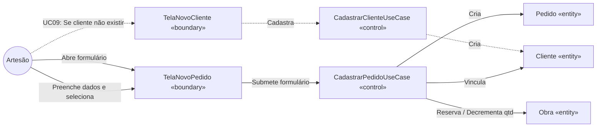

# Tarefa 7 — Classes de Fronteira, Controle e Entidade (BCE)
## App de Gestão para Artesãos

---

Esta etapa reclassifica os elementos levantados até aqui na visão da Análise BCE (Boundary-Control-Entity), preparando o terreno para as camadas de Clean Architecture (Boundary = Interface Adapters / Control = Application / Entity = Domain).

## 7.1 Mapeamento BCE por Caso de Uso Principal

| Caso de Uso (UC) | Boundary (Telas / Triggers) | Control (Use Cases / Services) | Entities Envolvidas |
|------------------|----------------------------|--------------------------------|----------------------|
| UC01 Realizar Login | `TelaLogin` | `AuthUseCase` | `Usuario` (remoto) |
| UC03 Visualizar Kanban | `TelaKanban` | `ConsultarPedidosUseCase` | `Pedido`, `Cliente`, `Obra` |
| UC05 Concluir Pedido | `TelaKanban`, `CameraView` | `ConcluirPedidoUseCase` | `Pedido`, `Obra` |
| UC07 Registrar Novo Pedido | `TelaNovoPedido`, `CameraView` (opcional) | `CadastrarPedidoUseCase` | `Pedido`, `Cliente`, `Obra` |
| UC09 Cadastrar Cliente | `TelaNovoCliente` | `CadastrarClienteUseCase` | `Cliente` |
| UC12 Consultar Estoque | `TelaEstoque` | `ConsultarEstoqueUseCase` | `Obra` |
| UC13 Cadastrar Obra | `TelaNovaObra`, `CameraView` (opcional) | `CadastrarObraUseCase` | `Obra` |
| UC14 Registrar Preço | `TelaHistoricoPrecos` | `RegistrarPrecoUseCase` | `HistoricoPreco` |
| UC16 Cadastrar Evento | `TelaNovoEvento`, `MapaView` | `CadastrarEventoUseCase` | `Evento` |
| UC19 Sincronizar Dados | `SyncServiceWorker` (Background) | `SincronizarDadosUseCase` | `FilaSync`, `Pedido`, `Cliente`, `Obra`, `Evento`, `HistoricoPreco` |

*(base: Tarefas 2 e 3)*

---

## 7.2 Diagramas de Robustez

Os diagramas abaixo ilustram o fluxo de responsabilidade Ator → Boundary → Control → Entity, simplificando a visualização de quem chama quem.

### Fluxo 1: UC05 Concluir Pedido (Fazendo → Feito)

Demonstra a restrição (RNF12) de uso obrigatório da câmera antes que a lógica de aplicação altere o status da entidade Pedido, que por sua vez altera o status da Obra associada.

```mermaid
flowchart LR
    Ator((Artesão))
    B1[TelaKanban «boundary»]
    B2[CameraView «boundary»]
    C[ConcluirPedidoUseCase «control»]
    E1[Pedido «entity»]
    E2[Obra «entity»]

    Ator -->|Clica mover p/ Feito| B1
    B1 -->|Exige foto| B2
    Ator -->|Captura foto| B2
    B2 -->|Confirma foto| C
    C -->|concluir(foto)| E1
    C -->|darBaixa()| E2
```

### Fluxo 2: UC07 Registrar Novo Pedido

Demonstra o fluxo de cadastro envolvendo o vínculo com cliente (existente ou novo) e a seleção opcional de uma obra do catálogo.



*(base: Tarefa 2 — Fluxos Alternativos e Inclusões; Tarefa 3 — Restrições de métodos)*
