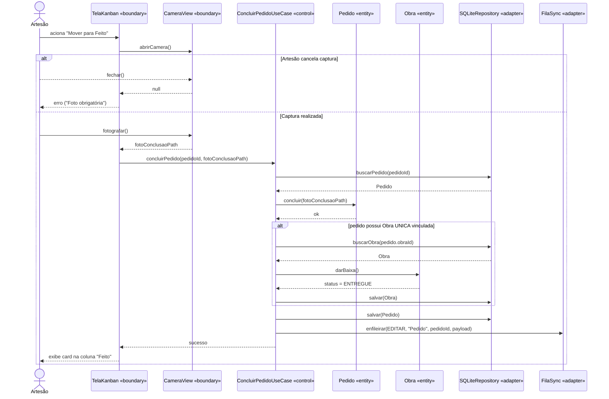
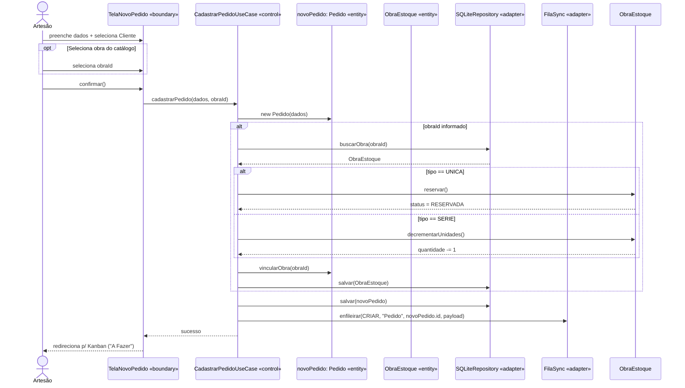

# Tarefa 8 — Diagramas de Sequência
## App de Gestão para Artesãos

---

Os diagramas de sequência abaixo expandem a visão de robustez (Tarefa 7), inserindo a linha do tempo, retornos síncronos, os participantes de infraestrutura (Repositórios e Fila de Sync do SQLite) e os fragmentos de condição (`alt`) que executam as regras de negócio de domínio (TDD/Clean Architecture).

## 8.1 UC05 — Concluir Pedido (Fazendo → Feito)

Demonstra a validação rigorosa da foto e o enfileiramento offline.

## 8.2 UC07 — Registrar Novo Pedido

Demonstra o cadastro de um pedido com seleção de cliente e a bifurcação de regra de negócio (reserva vs. baixa) dependendo do tipo da obra selecionada do estoque.

*(base: Tarefa 2 - fluxos principais; Tarefa 3 - restrições de métodos; RF05, RF11, RF18)*
